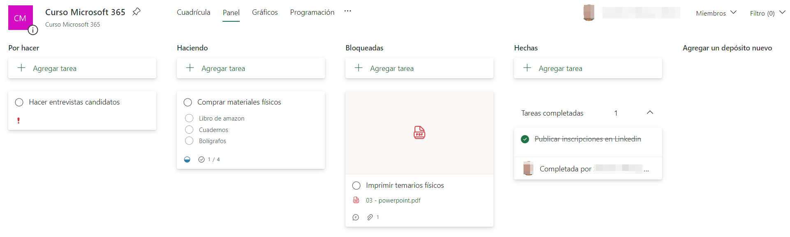
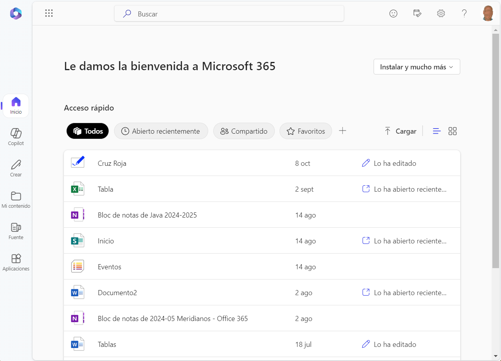
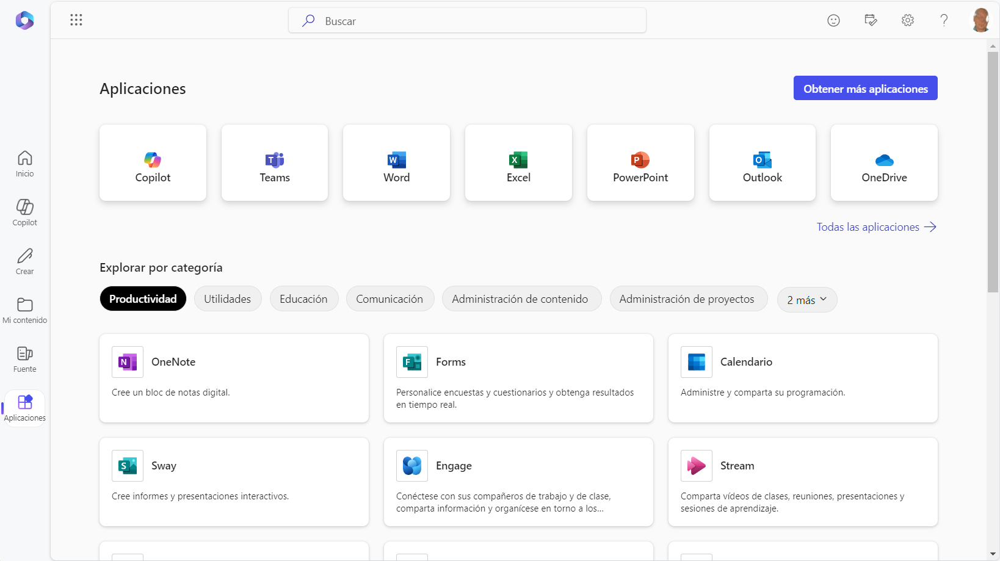

  0. Introducción a Microsoft 365

[TOC]

---

# Introducción

## 쯈ué es Microsoft 365?

Microsoft 365, anteriormente conocido como Office 365, es un servicio de suscripción de Microsoft que ofrece una suite completa de aplicaciones ofimáticas. Entre las aplicaciones más utilizadas se encuentran Word, Excel, PowerPoint, Outlook y OneNote. Microsoft 365 no solo proporciona acceso a estas aplicaciones en sus versiones más recientes, sino que también incluye almacenamiento en la nube a través de OneDrive, herramientas de colaboración como Microsoft Teams y actualizaciones continuas para mantener el software seguro y eficiente.

## Ventajas de Microsoft 365

- **Acceso desde cualquier lugar:** Las aplicaciones de Microsoft 365 están disponibles en la web, lo que permite acceder y trabajar en documentos desde cualquier dispositivo con conexión a internet.
- **Colaboración en tiempo real:** Permite la coautoría de documentos en tiempo real, facilitando la colaboración entre equipos y la revisión conjunta de proyectos.
- **Almacenamiento en la Nube:** Ofrece almacenamiento en la nube con OneDrive, permitiendo guardar y compartir documentos de manera segura.
- **Actualizaciones continuas:** Los usuarios siempre tienen acceso a las últimas versiones de las aplicaciones y las actualizaciones de seguridad.
- **Seguridad:** Microsoft 365 protege los datos con medidas avanzadas, como cifrado y autenticación multifactor.

## Beneficios para la empresa y sus empleados

Microsoft 365 ofrece soluciones que pueden ser de gran ayuda para empresas de cualquier tamaño, permitiendo optimizar recursos, mejorar la comunicación y aumentar la eficiencia de los equipos. Entre los beneficios más relevantes destacan:

- **Colaboración sin barreras:** Microsoft 365 facilita el trabajo en equipo incluso cuando los empleados están en ubicaciones geográficas distintas. Herramientas como Teams permiten mantener una comunicación constante, organizar reuniones virtuales y trabajar en conjunto en documentos en tiempo real, sin importar dónde se encuentren.

  

- **Gestión de proyectos y organización de recursos:** Aplicaciones como *Planner* y *To Do* ayudan a estructurar y organizar tareas, facilitando la asignación de responsabilidades y el seguimiento de proyectos en curso. Esto es ideal para coordinar esfuerzos en iniciativas específicas dentro de la empresa y asegurar que cada miembro tenga claro su rol y sus tareas.

  

- **Almacenamiento seguro y accesible:** Con OneDrive y SharePoint, la empresa puede almacenar de forma segura documentos importantes, como informes, contratos o presupuestos. Además, estos archivos están disponibles en la nube, por lo que se puede acceder a ellos desde cualquier dispositivo, lo que facilita compartirlos entre los miembros autorizados sin necesidad de estar en la oficina.

- **Comunicación eficiente con clientes y colaboradores:** Outlook facilita la comunicación no solo interna, sino también con clientes, proveedores y otros contactos externos. Además, la integración con Teams permite una gestión completa de la correspondencia y las reuniones, incluyendo la posibilidad de crear reuniones en línea con participantes externos.

- **Automatización de procesos repetitivos:** Power Automate permite automatizar tareas que pueden consumir mucho tiempo, como el envío de recordatorios o la actualización de bases de datos. Esto reduce la carga de trabajo en tareas repetitivas, dejando más tiempo para centrarse en objetivos estratégicos.

- **Herramientas de análisis de datos:** Con Power BI, la empresa puede realizar análisis de datos sobre proyectos, resultados, ventas, rendimiento del equipo, etc. Esto permite generar informes visuales y obtener insights que ayudan en la toma de decisiones estratégicas.

  

## Configuración básica y acceso a las aplicaciones

1. **Acceso:** Visita [www.office.com](https://www.office.com) e inicia sesión con tu cuenta de Microsoft 365.
2. **Exploración de la interfaz:** en la pantalla principal verás todas las aplicaciones disponibles. Haz clic en cualquier icono para abrir la aplicación correspondiente.
3. **Personalización:** en la esquina superior derecha, puedes personalizar tu perfil, gestionar notificaciones y cambiar configuraciones básicas.

🟦**Pestaña de inicio:** Aquí verás un resumen de tu actividad, archivos compartidos, abiertos y editados recientemente.

🟦**Pestaña de Aplicaciones:** Desde aquí podrás acceder a todas las aplicaciones, tanto en sus versiones web como al instalador para las versiones de escritorio.

🟦**Configuración:** Aquí podrás cambiar el tema por defecto (fondo y combinación de colores) de la pantalla principal de office.com.

