

  1. Microsoft Word

[TOC]

---

# 1. Entorno

## Introducción

Word es una aplicación de procesamiento de texto que te permite crear, editar y dar formato a documentos. Puedes usar Word para escribir cartas, informes, currículums, ensayos, o cualquier cosa que necesites.

### Versiones y nomenclaturas

La confusión en torno a las versiones de Word puede ser comprensible. Tradicionalmente, las versiones de Word para escritorio se han denominado “Word” seguido del año de la versión (por ejemplo, Word 2016, Word 2019, etc.). Sin embargo, en 2011, Microsoft lanzó Office 365, un servicio de suscripción basado en la nube que también incluye Word. Aunque no se llamó “Word 365”, simplemente se le conoce como “Word”. Esto ha generado confusión, ya que a veces no queda claro si nos referimos a la versión de escritorio o a la de Office 365.

Además, en 2020, Microsoft cambió el nombre de “Office 365” a “Microsoft 365”, pero todavía se sigue utilizando el término “Office” en muchos contextos. En 2021, Microsoft se refiere a la versión por suscripción como “Word” o “Word Microsoft 365”, pero no como “Word 365”. Por otro lado, la versión de escritorio sigue siendo llamada “Word 2022”. Esta falta de claridad podría deberse a que Microsoft está interesada en que la versión de escritorio desaparezca gradualmente en favor de “Word” dentro de Microsoft 365. Es posible que, cuando leas esto, solo exista una única versión de Word por suscripción o que Microsoft haya cambiado nuevamente la nomenclatura.

## Crear un documento nuevo

Al arrancar Word aparece una pantalla inicial como esta.

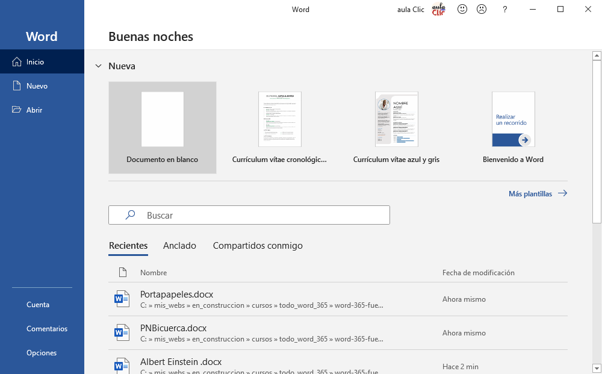

Si hacemos clic en la opción **Documento en blanco**, aparece una pantalla como ésta.

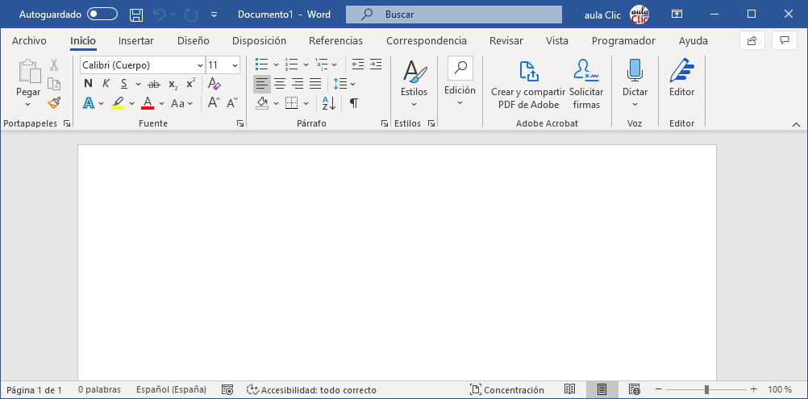En la sección [Entorno de Word](#Entorno de Word) veremos todos sus componentes; ahora nos vamos a fijar sólo en algunas cosas.

🟦**Nombre del documento**. En el centro de la parte superior encontramos, la **barra del título**. En ella aparece el **nombre del documento** sobre el que estamos trabajando, en este caso **Documento1**. Al abrir un documento en blanco Word le asigna el nombre **Documento1**. Cuando guardemos el documento le cambiaremos el nombre.

### Nociones básicas sobre entrada de texto

> [!TIP]
>
> Dependiendo del nivel del alumnado, se podrá saltar esta parte o avanzar más rápido.

Ahora vamos a explicar cómo escribir tu primer documento, y aprenderás cómo corregir los pequeños errores y cómo desplazarte por el documento.

🟦**Saltos de línea**. Al escribir un texto hay que teclearlo sin más. Por ejemplo puedes escribir **Al asomar la cabeza, quedó deslumbrado.** Si sigues escribiendo hasta completar más de una línea observarás que los saltos de línea se realizan automáticamente al llegar al margen derecho. Si quieres realizar un cambio de línea de forma explícita, deberás utilizar las teclas <kbd>MAYUSCULAS + INTRO</kbd>. Si quieres realizar un salto de párrafo deberás utilizar la tecla <kbd>INTRO</kbd>. Un salto de párrafo deja más espacio que un salto de línea. La tecla <kbd>INTRO</kbd> es una tecla grande situada en la zona derecha del teclado alfabético. Su dibujo representativo suele ser una flecha con la forma que indica que baja la línea y se sitúa al principio de la siguiente (a la izquierda).

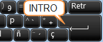

🟦**Punteros**. Una pequeña barra vertical parpadeante es la que marca tu posición en el texto. Se llama **punto de inserción** o **cursor**, porque allí donde esté situada es donde se introducirá el texto que teclees. Observarás que va avanzando según vas escribiendo.

No confundas el **cursor** con el **puntero del ratón**.
\- El puntero tiene esta forma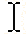 cuando está dentro del área de texto, y esta otra  cuando está encima de los menús, también puede tomar otras formas que iremos viendo más adelante.

Cuando mueves el ratón, lo que estás moviendo es el puntero; cuando pulsas las teclas de dirección del teclado, mueves el cursor. Al hacer clic, colocas el cursor en el lugar donde estaba el puntero.

🟦**Errores**. Al escribir es habitual cometer errores, pero la redacción de textos en ordenador tiene la ventaja de facilitar su corrección. Para borrar texto disponemos de la tecla <kbd>RETROCESO</kbd>. Esta tecla suele encontrarse justo encima de <kbd>INTRO</kbd>y normalmente tiene dibujada una flecha larga hacia la izquierda.

\- Cuando cometas un error, y te des cuenta inmediatamente, pulsa la tecla <kbd>RETROCESO</kbd> una vez para que retroceda una posición borrando la última letra tecleada. Si mantienes la tecla pulsada, seguirá borrando letra tras letra hasta que la sueltes, así que utilízala con cierto cuidado para controlar su efecto.

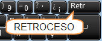

\- Es posible que no te des cuenta del error hasta después de haber escrito unas cuantas letras más. En ese caso no sería bueno que borraras toda la frase por un error que está al principio de la misma. Lo normal es que desplaces el punto de inserción hasta el error y una vez te hayas situado, utilices el <kbd>RETROCESO</kbd>.
El desplazamiento, como ya comentamos anteriormente, se suele realizar con las flechas del teclado. Normalmente se encuentran en la zona inferior del teclado, cerca de la tecla <kbd>INTRO</kbd>.

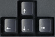

\- Si te das cuenta del error cuando tienes el punto de inserción lejos de él, lo mejor es hacer clic tras la letra que queremos borrar.
Es importante que lo hagas de esta forma por cuestión de tiempo. Dejar el teclado para coger el ratón y hacer clic supone una pérdida de tiempo, por lo que sólo utilizaremos el ratón en los casos en que el desplazamiento con teclado nos vaya a costar más.

La tecla suprimir (<kbd>DEL</kbd> o <kbd>SUPR</kbd>) también borra una letra, pero la que queda a la derecha del punto de inserción.

> [!TIP]
>
> Si necesitas mejorar tu velocidad de escritura en ordenador, te recomendamos el siguiente recurso gratuito: 
>
> ⚡⌨️ https://www.typing.com/es

## 👩‍🏫Ejercicio 1a

1. Crear un documento nuevo.

2. Escribir el siguiente párrafo: 

   > El veloz murciélago hindú comía feliz cardillo y kiwi. La cigüeña tocaba el saxofón detrás del palenque de paja. Quiere la boca exhausta vid, kiwi, piña y fugaz jamón. Fabio me exige, sin tapujos, que añada cerveza al whisky. Jovencillo emponzoñado de whisky, ¡qué figurita exhibe!.

3. Pulsa la tecla <kbd>Intro</kbd> para escribir en una nueva línea y escribe tu nombre y apellidos.

4. Y no hagas nada más. Deja el archivo abierto y continuaremos más adelante.

## Guardar un documento

Lo que hemos escrito anteriormente, si no lo guardamos, se podría perder si apagamos el ordenador. Por eso hay que guardarlo, para poder recuperarlo cuando queramos y seguir trabajando en el mismo documento.

Haz clic en el icono **Guardar**  de la zona superior izquierda o pulsa las teclas CTRL + G, como es la primera vez que guardamos el documento, aparecerá una ventana similar a esta.

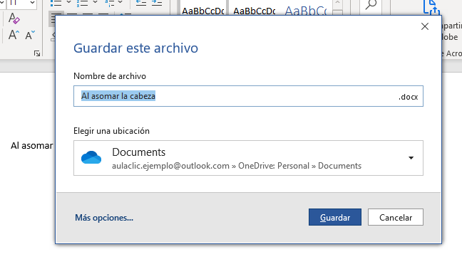

Como se ve en la imagen, al guardar la primera vez un documento, Word introduce en el recuadro **Nombre de archivo** las primeras palabras que hayas escrito en el documento, por si quieres darle ese nombre; si no es así empieza a escribir otro nombre.

Además del nombre del archivo, es muy importante saber la **ubicación del archivo**, es decir, dónde lo estamos guardando. Para ello tenemos el desplegable **Elegir una ubicación** De forma predeterminada es la carpeta **Documentos**, bien de la ubicación de OneDrive o bien de nuestro ordenador, según estemos utilizando Word 365 o Word de escritorio. Como vemos en el ejemplo, aparece la ubicación de OneDrive (icono de la nube azul).

> [!TIP]
>
> Es muy importante saber la ubicación, ya que es un error muy común el guardar el archivo y no saber dónde. Perderemos muchísimo tiempo para volver a encontrarlo, si es que lo encuentras 😅.

No obstante, si queremos guardar el documento en nuestro ordenador podemos hacerlo de dos formas, la primera es abrir el desplegable y veremos una lista con otras ubicaciones usadas recientemente, como muestra la siguiente imagen.

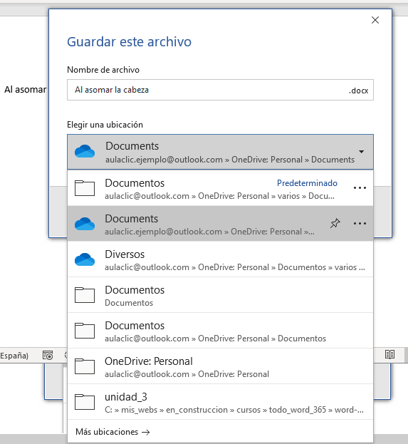

Como vemos, las ubicaciones que empiezan por la letra C: ( o D:) son carpetas de nuestro ordenador. Podemos elegir una y luego pulsar el botón , y la otra forma que decíamos es pulsar en **Más ubicaciones ->** con lo que abrirá la pantalla **Guardar como** que se muestra en la siguiente imagen.

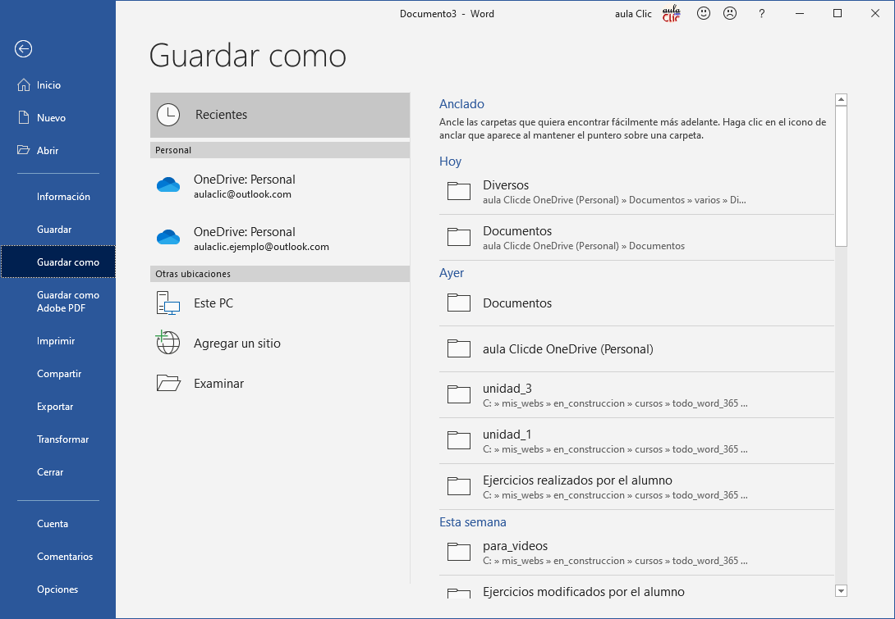

También llegaríamos a esta pantalla **Guardar como** si pulsamos en **Más opciones ...** que veíamos antes de abrir el desplegable con las ubicaciones. De ambas formas, en esta pantalla se muestran las ubicaciones **Recientes** por si queremos elegir una de ellas, en otro caso podemos buscar otra carpeta pulsando en **Este PC** o en **Examinar**. Estas dos opciones son muy parecidas, ambas muestran las carpetas de nuestro ordenador, la diferencia es la forma de verlas, con **Este PC** veremos las carpetas desde dentro de Word, como muestra la primera imagen, y desde **Examinar** las veremos desde el **Explorador de archivos de Windows**, como muestra la segunda imagen.

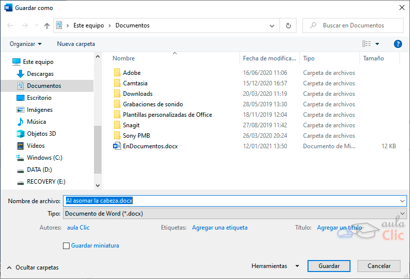

 

En ambos casos, observa que por defecto, se abre la carpeta **Documentos**. Para guardar un documento debes indicar el nombre con el que lo quieres guardar, el tipo de documento que estás guardando y la carpeta que lo contendrá

> \- El **nombre** lo indicamos en el campo **Nombre de archivo**, donde ahora pone **Al asomar la cabeza.docx**.
>
> \- El **tipo** del documento para los documentos Word será **Documento de Word(\*.docx)**, que ya viene escrito por defecto.
>
> \- Los documentos dentro del disco duro están organizados en **carpetas**. Por defecto normalmente se guardarán en la carpeta **Documentos**. Pero siempre podrás elegir o crear otra carpeta. En este caso hemos elegido la carpeta Documentos.

Una vez hayas definido los tres aspectos, deberás hacer clic en el botón **Guardar**. En ese momento, la barra de título indicará el nombre que le hayas dado.

En la Unidad 4 veremos con más profundidad todo lo referente a guardar documentos.

## 👨‍🏫Ejercicio 1b

Seguimos los pasos descritos anteriormente hasta guardar el documento en nuestro ordenador  bajo el nombre de "`Ejercicio 1 - Meridianos.docx`" y en la ubicación nuestra carpeta "`Documentos`".

## Entorno de Word

Al arrancar Word aparece una pantalla muy similar a la siguiente:

 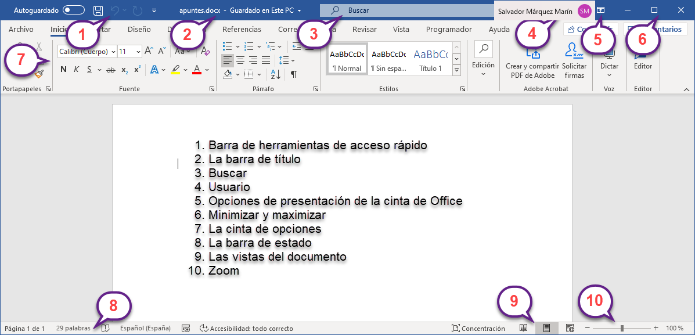

 La ventana de Word se puede personalizar (lo veremos más adelante), para cambiar las herramientas y botones que hay disponibles, de modo que debes tomar las imágenes del curso como un recurso orientativo, que puede no ser idéntico a lo que veas en tu pantalla.

Hemos incluido notas descriptivas de cada elemento. Es importante que te vayas familiarizando con los nombres de cada uno, para que sigas fácilmente las explicaciones, ya que se suelen utilizar estos términos.

Comentemos, a grandes rasgos, las **características** de cada elemento.

1. La **barra de herramientas de acceso rápido**  contiene, normalmente, las opciones que más frecuentemente se utilizan. Los botones son los siguientes: **Autoguardado**, para activar el guardado automático, **Guardar**, **Deshacer** (para deshacer la última acción realizada) **Rehacer** (para recuperar la acción que hemos deshecho) y **Personalizar**. 

Cuando estamos en un documento guardado en OneDrive esta barra cambia ligeramente,  **Autoguardado** esta activado por defecto y el botón **Guardar** es diferente ya que implica **sincronizar** los cambios con otros usuarios que estén compartiendo el documento. Todo esto lo veremos más adelante.

2. La **barra de título**,  como ya hemos comentado, contiene el nombre del documento abierto que se está visualizando, además el pequeño triángulo de la derecha abre la ventana del **Historial de versiones** que veremos en la unidad 4. Cuando el documento no está guardado en OneDrive, lo indica expresamente "Guardado en este PC".
3. **Buscar**,  esta caja de búsqueda permite realizar búsquedas de texto en el propio documento y también buscar un comando de Word, por último permite buscar en Internet utilizando el buscador Bing de Microsoft. Lo veremos todo en detalle en el último punto de esta unidad.
4. **Usuario**, 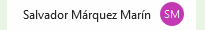 aquí se muestra el nombre y el icono del usuario con el que estamos accediendo a Word. Si pulsamos se abrirá el desplegable que ves a continuación.

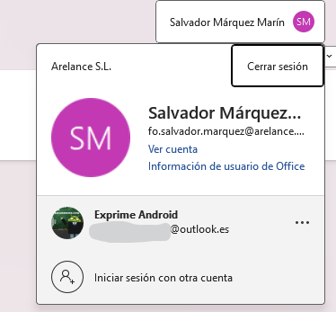

Desde aquí podemos **Cerrar la sesión**, acceder a nuestra **cuenta de Microsoft**, a la **información de usuario de Office** donde veremos los datos de nuestra suscripción a Office, **cerrar otra sesión** si la tuviéramos abierta, e **Iniciar la sesión en otra cuenta** de Microsoft.

5.  **Opciones de presentación de la cinta de Office**. Si haces **doble clic** sobre cualquiera de las pestañas, la barra se **ocultará**, para así disponer de más espacio de trabajo. Los comandos volverán a mostrarse en el momento en el que vuelvas a hacer **clic** en cualquier pestaña. Puedes cambiar es comportamiento por defecto haciendo clic en este botón , se abrirá la ventana que se muestra a continuación, con tres opciones. La opción por defecto es la tercera, la primera opción mantiene oculta la cinta hasta que haces clic en la parte superior de la pantalla, la segunda opción sólo muestra las pestañas, pero no los comandos, al hacer clic en una pestaña mostrará los comandos.

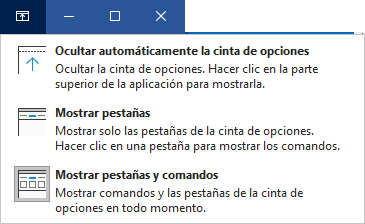

6. Los **botones**  para cambiar **minimizar** y **maximizar** la ventana de Word y para **cerrar** Word.
7. La **cinta de opciones** es el elemento más importante de todos, ya que se trata de una franja que contiene las herramientas y utilidades necesarias para realizar acciones en Word.

Se organiza en **pestañas** que engloban categorías lógicas, por ejemplo, Inicio, Insertar, etc. Para cada pestaña hay una cinta de opciones diferente. Las veremos en detalle en el siguiente apartado.

 

8. La **barra de estado** muestra información del estado del documento, como el número de páginas y palabras, el idioma en que se está redactando, botón para grabar macros y estado de la accesibilidad.

Si hacemos clic sobre el número de páginas se abrirá el **panel de Navegación** que nos ofrece unas miniaturas de todas las páginas del documento y permite ir a una determinada página haciendo clic sobre su miniatura.

9. Las **vistas del documento** 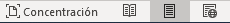 definen la forma en que se visualizará la hoja del documento. Por defecto se suele mostrar en **Vista de impresión**. Esto significa que veremos el formato de la hoja tal cual se imprimirá. Otros modos son para **leer**, para **diseño web** y el modo "**concentración**" que elimina todos las barras y pone fondo negro.
10. **Zoom** 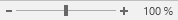 se puede deslizar el marcador hacia los botones **-** y **+** para **alejar** o **acercar** el punto de vista, para apreciar en mayor detalle o ver una vista general del resultado. También podemos pulsar directamente sobre el valor porcentual para abrir una ventana donde ajustar el zoom deseado con varias opciones que se muestran en una vista previa, como muestra esta imagen.

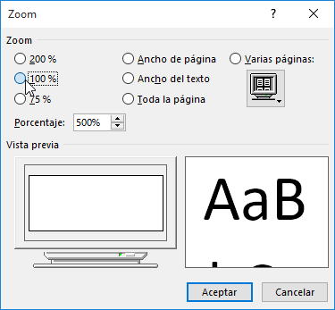

 

11. Las **barras de desplazamiento** permiten la desplazar el documento cuando no cabe en la ventana. Hay una para desplazar el documento de forma vertical y otra de forma horizontal. En la imagen siguiente vemos ambas barras.

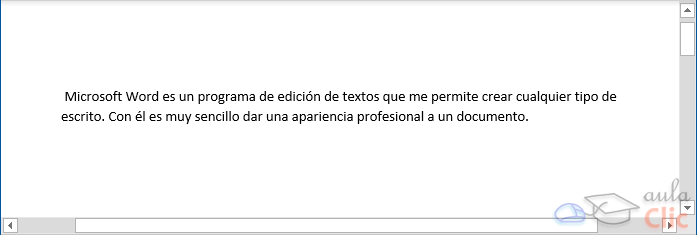

Si el documento ocupa menos del tamaño de la ventana, las barras de desplazamiento no aparecen, puedes forzar a que se muestren haciendo clic en el borde derecho del documento, justo donde deberán aparecer las barras.

## Cinta de opciones

Hemos comentado que la cinta es la barra más importante de Word, porque contiene todas las opciones que se pueden realizar con los documentos. Veámosla con más detalle.

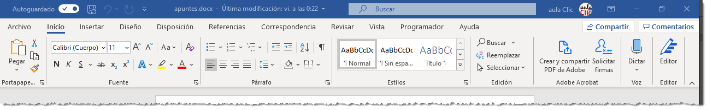

Las herramientas están organizadas de forma lógica en pestañas o fichas (**Inicio**, **Insertar**, **Diseño**...), que a su vez están divididas en grupos. 

Por ejemplo, en la imagen vemos la pestaña más utilizada, **Inicio**, que contiene los grupos **Portapapeles**, **Fuente**, **Párrafo** y **Estilos**. De esta forma, si queremos hacer referencia durante el curso a la opción **Negrita**, la nombraremos como **Inicio** > **Fuente** > **Negrita**.

Para situarte en una ficha diferente, simplemente haz clic en su correspondiente nombre de pestaña.

> [!TIP]
>
> 🤯 No intentes memorizar la ubicación de las opciones. Las más comunes terminarás por aprenderlas, y las demás simplemente las buscas cuando te hagan falta. Ten en cuenta que estas opciones suelen cambiar muy a menudo entre distintas versiones y no merece la pena memorizar nada. **Aprende a buscar eficientemente y nunca tendrás que memorizar.**

Las pestañas pueden estar disponibles o no. La cinta tiene un comportamiento "inteligente", que consiste en mostrar determinadas pestañas únicamente cuando son útiles, de forma que el usuario no se vea abrumado por una gran cantidad de opciones. Por ejemplo, la ficha **Herramientas de tabla** no estará visible de entrada, únicamente se mostrará si insertamos una tabla en nuestro documento y la seleccionamos.

Esta función permite una mayor comodidad a la hora de trabajar, pero si en algún momento queremos ocultar o inhabilitar alguna de ficha de forma manual, podremos hacerlo desde el menú **Archivo** > **Opciones** > **Personalizar Cinta de opciones**, o pulsando con el botón derecho sobre la cinta de opciones y eligiendo **Personalizar Cinta de opciones**.

### Accesibilidad

En Word se apuesta por dotar de **accesibilidad** al programa, pudiendo controlarlo por completo **mediante el teclado**.

Pulsando la tecla <kbd>ALT</kbd> entraremos en el modo de acceso por teclado. De esta forma aparecerán pequeños recuadros junto a las pestañas y opciones indicando la tecla (o conjunto de teclas) que deberás pulsar para acceder a esa opción sin la necesidad del ratón. Por ejemplo para poner en negrita la palabra "Microsoft" la seleccionamos y pulsamos la tecla <kbd>ALT</kbd> con lo cual veremos las teclas disponibles, como muestra la siguiente imagen.

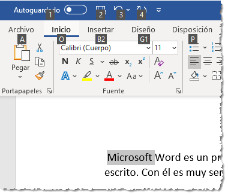

Ahora, como el tipo de fuente **Negrita** está dentro de la pestaña **Inicio**, pulsamos la letra **O**, tal como se nos indica, y veremos la siguiente pantalla.

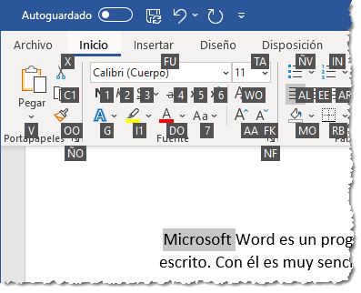

Si nos fijamos bien, vemos que Negrita tiene asignado el número **1**, por lo tanto, al pulsar 1, la palabra seleccionada se pondrá en negrita.

Resumiendo, para poner en negrita, seleccionamos la palabra, pulsamos la tecla <kbd>ALT</kbd>, y luego la tecla 1,

Para salir del modo de acceso por teclado vuelve a pulsar la tecla <kbd>ALT</kbd>.

> [!NOTE]
>
> Si no necesitas el modo accesible, no es conveniente que utilices los atajos de teclado ya que podría complicar en exceso el aprendizaje.

### Pestaña archivo

La pestaña **Archivo** es diferente al resto de pestañas, ya que no **contiene** herramientas para la modificación y tratamiento del contenido del documento, sino más bien **opciones referentes a la aplicación y al archivo resultante**. Al situarnos en esta pestaña, se cubre el documento con un panel de opciones.

De hecho, su estructura es distinta al resto de fichas, por eso la vamos a comentar a partir de la siguiente imagen.

Observarás que sus opciones no se encuentran en una ficha como las que hemos visto hasta ahora. Están situadas en forma de menú vertical.

La principal característica de la vista **Archivo** es que para cada comando de la parte izquierda se abre otra ventana con diferentes configuraciones, para la mayoría de los comandos tiene una estructura similar, que vamos a explicar con la imagen siguiente correspondiente al comando **Compartir**, aunque es parecida para los comandos `Guardar como`, `Imprimir`, `Cuenta`, `Exportar` y `Comentarios`.

Como vemos en la imagen, los comandos de la izquierda se mantienen y aparecen unas opciones en la parte central, y a su vez, para cada una de estas opciones aparecen otras opciones más en la parte derecha de la pantalla. Por ejemplo, en la imagen vemos como el comando **Compartir**, en la parte central, genera las opciones **apuntes**, **Compartir**, **Correo electrónico**, ... y para **Correo electrónico**, aparecen más opciones en la parte izquierda, **Enviar como datos adjuntos**, **Enviar un vínculo**, ...

`Compartir` > `Correo electrónico` 

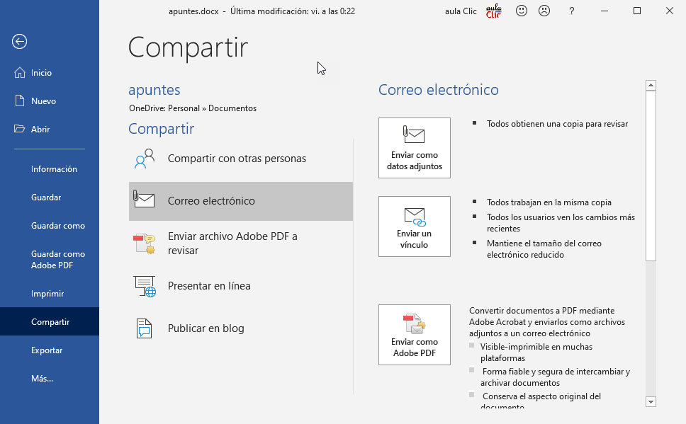

Otra particularidad de la ventana **Archivo** y de sus ventanas hijas, es la presencia del botón  para volver atrás.

## 👨‍🏫Ejercicio 2

**2.1 Cinta de opciones**

1. Abre Word. En la pantalla inicial verás los documentos **Recientes**. Si se muestra el documento que creaste anteriormente, haz clic para abrirlo.
2. En otro caso haz clic en **Más documentos** y búscalo, puedes utilizar la caja **Buscar**.
3. Una vez lo has encontrado, ábrelo. Observa que Word nos ha situado de nuevo en la ficha **Inicio**.
4. Ve haciendo clic en todas las pestañas, una por una y en orden, para observar cómo van cambiando las opciones de la cinta.
5. Luego, regresa a la ficha **Inicio** y localiza el grupo **Párrafo**. Recuerda que el nombre de grupo siempre está escrito en la zona inferior de la cinta, y que cada grupo está separado del resto por unas líneas verticales que delimitan sus herramientas.
6. Haz clic en tu nombre y pulsa el botón **Centrar** del grupo **Párrafo**. Para saber cuál es, como siempre, recorre uno a uno los botones sin hacer clic en ellos. El nombre ahora aparecerá alineado horizontalmente al centro de la página.
7. Localiza la acción **Deshacer** (esquina superior izquierda, junto al nombre). Pulsa el botón. Observarás que el nombre vuelve a su posición inicial, deshaciendo la acción de centrado que acabamos de realizar.
8. Ahora, haz clic en el botón de la esquina inferior derecha del grupo **Párrafo**, para ver más opciones del grupo. Se abrirá un cuadro con más opciones. Obsérvalo y ciérralo.

**2.2 Pestaña Archivo**

1. Haz clic sobre la ficha **Archivo**. Observa que ya no se ve el documento, sino que las opciones ocupan toda la superficie de la ventana.
2. Pasa el ratón sin hacer clic por cada una de las opciones del menú de la izquierda. Haz clic en **Opciones** y observa que se muestra una nueva ventana con las diferentes opciones de personalización. Además te sacará de la ficha **Archivo**, y nos situará en la ficha **Inicio** con el documento abierto.
3. Regresa de nuevo a la ficha **Archivo**. Observa que la opción **Recientes** está subrayada y muestra debajo la lista de archivos recientemente utilizados. En este caso no abriremos ninguno.
4. Ahora haz clic en la opción **Nuevo** del menú lateral izquierdo y fíjate en que ahora se muestran las plantillas para abrir documentos.
5. Para finalizar, haz clic en la flecha superior izquierda y luego en la X de la derecha para cerrar Word.

---

# 2. Edición básica

## Estructura de texto

Hemos visto que escribir nuestro primer documento, básicamente se trata de teclear el texto y controlar siempre dónde está situado el punto de inserción. En este apartado vamos a ver algunas consideraciones útiles a tener en cuenta, dejando de lado las cuestiones estéticas y de formato que veremos más adelante.

En el documento podemos definir qué texto es el título, cuál el subtítulo, y cuál los párrafos de contenido. Ésta distinción no es únicamente estética, sino que ayuda a Word a hacerse una idea de la **estructura del documento** y esto a la larga nos ayudará en nuestro trabajo. También mejora la accesibilidad para personas con discapacidad visual, ya que les ayuda a moverse por el contenido del documento.

> [!TIP]
>
>  Un documento bien estructurado siempre es más sencillo de manejar y es más accesible.

Desde la pestaña **Inicio** > grupo **Estilos**, encontramos un cuadro que nos permite elegir el tipo de texto que vamos a introducir.

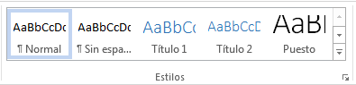

De este modo, si pulsas **Título 1** y a continuación escribes algo, se considerará que el texto introducido es un título. Es la forma de etiquetar cada uno de los elementos del archivo para darle una estructura.

Si tenemos seleccionado un estilo como **Título 1**, después de escribir un texto y pulsar INTRO, Word saltará de párrafo y asumirá que quieres cambiar de estilo y pasará al estilo **Normal**. Pero siempre puedes cambiarlo, por ejemplo, para elegir insertar un **Título 2** para incluir un subtítulo. **Título 2** implica un nivel más bajo en la jerarquía estructural .

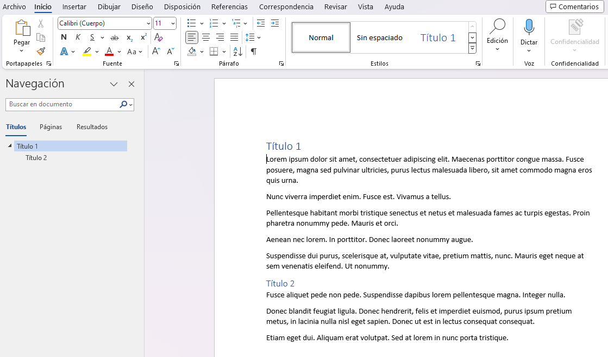

Aunque cada **Título** tiene su propio estilo (tipo de letra, tamaño, color, etc.) **no se deben usar para aplicar estilos al documento**. Se deberá usar ESTRICTAMENTE para dar una ESTRUCTURA al documento. Posteriormente a cada nivel de esa estructura podremos personalizar los estilos, pero será secundario.

## Saltos de página

Como ya sabes, Word se encarga de que el texto que vas introduciendo se contenga dentro de unos márgenes, de forma automática pasa a la línea siguiente cuando alcanza el margen derecho. Pero conviene saber que, si algún momento quieres realizar un **salto de línea** de forma voluntaria, lo puedes hacer con la combinación de teclas <kbd>MAYÚS + INTRO</kbd>.

🟦 A primera vista el resultado será casi el mismo que si pulsaras simplemente <kbd>INTRO</kbd>, pero no es así. La diferencia es que al pulsar <kbd>INTRO</kbd>se inserta un **salto de párrafo** mientras que con <kbd>MAYÚS + INTRO</kbd> se inserta un **salto de línea**. La consecuencia es que el salto de párrafo, normalmente, tiene una separación mayor con la línea anterior que el salto de línea. Más adelante veremos más claramente las diferencias entre ambos saltos.

🟦 Los **saltos de página** se insertan automáticamente cuando llegamos al margen inferior de una página y seguimos escribiendo. También se pueden insertar de forma manual si queremos pasar a la página siguiente aunque no hayamos llegado al final, desde la pestaña **Insertar** > grupo **Páginas** > opción **Salto de página**. 

 🟦 La herramienta **Mostrar todo**  te permite saber si un texto ha sido dividido en bloques mediante saltos de línea o mediante párrafos. La encontrarás en la pestaña **Inicio** > grupo **Párrafo**. Tiene el siguiente aspecto: . Si la utilizas, el documento se llenará de marcas como las que ves en la imagen.

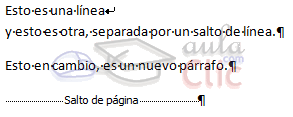

En el ejemplo, hemos escrito la primera frase y luego hemos pulsando <kbd>MAYÚS + INTRO</kbd> para realizar un salto de línea. Luego, hemos continuado escribiendo y, tras el punto final, hemos pulsando <kbd>INTRO</kbd>para empezar un párrafo nuevo.

Fíjate que, además de los saltos de línea y los cambios de párrafos también se muestran otros símbolos como un punto medio que señala que hay un **espacio** separando las palabras, o una marca de **salto de página**.

Para ocultar de nuevo estas marcas debemos pulsar de nuevo el botón .

## Dictar

También podemos introducir texto dictándolo directamente, obviamente debemos disponer de un micrófono conectado.

Desde el menú **Inicio** podemos pulsar en el icono **Dictar**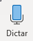y cambiará a esta forma 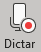 para indicar que Word está escuchando lo que digamos, de forma casi inmediata, veremos como va apareciendo el texto en el documento. Para dejar de dictar basta pulsar de nuevo en el icono .

Si queremos cambiar el **idioma** podemos hacerlo abriendo el desplegable que hay bajo el icono. Como muestra la siguiente imagen, hay multitud de idiomas disponibles.

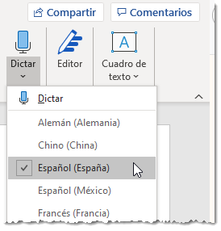

El sistema de **reconocimiento del habla funciona muy bien** y de forma rápida, por lo tanto es una opción a tener en cuenta a la hora de introducir texto. Sobre todo es muy útil si estamos utilizando Word desde un dispositivo móvil (smartphone, tablet, ...) ya que en estos casos utilizar el teclado tan pequeño es incomodo.

El sistema de dictado reconoce los **signos de puntuación** más usados, como los puntos, cambios de párrafo, las comas, etc.

En está imagen, obtenida de la **Ayuda** de Word, puedes ver lo que tienes que decir para obtener cada signo de puntuación.

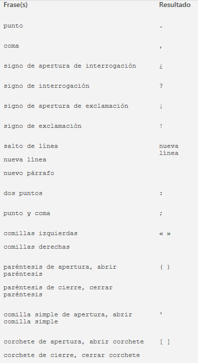

Por ejemplo, para escribir el signo "punto" simplemente hay que dictar "punto". Hay que decir que el sistema tiene cierto grado de **inteligencia artificial** y es capaz de distinguir cuando nos referimos al signo "punto" y cuando a la palabra "punto. 

Por ejemplo, si dictamos la frase: "`El resultado del partido fue dos a dos por lo tanto el equipo visitante ganó un punto y se coloca líder`", Word escribirá la palabra "punto" en lugar del signo "punto", esto último daría un resultado incorrecto: "`El resultado del partido fue dos a dos por lo tanto el equipo visitante ganó un. Y se coloca líder`". Para ayudar a Word hay que **entonar** correctamente y hacer las pausas adecuadas.

## Desplazarse por el documento

Una de las ventajas que han aportado los procesadores de texto es la facilidad para modificar y corregir. El primer paso en ese proceso es colocarnos en el lugar donde vamos a efectuar la modificación.

Por otra parte, cuando estamos viendo un documento Word que no cabe en una pantalla, necesitaremos movernos por el documento para colocarnos en la parte que nos interese.

Tanto en un caso como en otro será interesante conocer todas las formas que existen para desplazarse por el documento, y así poder elegir la más útil en cada momento.

Recordar que el elemento que define la posición dentro de un documento Word es el **cursor** que es una línea vertical parpadeante y nos indica dónde se va a escribir la próxima letra que tecleemos.

 

🟦 **Desplazamientos cortos dentro de una misma pantalla:**

**Con el ratón.** Desplazar el cursor del ratón hasta el punto elegido y hacer **clic**, el punto de inserción se colocará en ese lugar. En la pantallas táctiles, en lugar de utilizar el ratón podemos tocar con el dedo.

**Con las teclas de dirección.** Las teclas **izquierda/derecha** desplazan el punto de inserción una posición a la izquierda/derecha, y las **teclas arriba/abajo** desplazan el punto de inserción una línea arriba/abajo. La **tecla FIN** nos lleva al final de la línea y la **tecla INICIO** al principio de la línea.

Combinación de teclas:

|      Para desplazarse      |   Presione las teclas   |
| :------------------------: | :---------------------: |
| Una palabra a la izquierda | CTRL + flecha izquierda |
|  Una palabra a la derecha  |  CTRL + flecha derecha  |
|     Un párrafo arriba      |  CTRL + flecha arriba   |
|      Un párrafo abajo      |   CTRL + flecha abajo   |

 

🟦 **Desplazamientos a lo largo de todo el documento:**

Teclas <kbd>AvPág</kbd> y <kbd>RePág</kbd>. Estas teclas **avanzan y retroceden una pantalla completa**. Observad que no es lo mismo una pantalla que una página. El tamaño de la pantalla lo limita el monitor mientras que la longitud de la página la definimos nosotros.

Combinación de teclas:

|      Para desplazarse      |   Presione las teclas    |
| :------------------------: | :----------------------: |
|    Una página adelante     | <kbd>CTRL + AvPág</kbd>  |
|      Una página atrás      | <kbd>CTRL + RePág</kbd>  |
| Al principio del documento | <kbd>CTRL + Inicio</kbd> |
|   Al final del documento   |  <kbd>CTRL + Fin</kbd>   |

**Nota:** En los teclados en inglés las teclas tienen otros nombres: Inicio=Home, Fin=End, AvPág=PageUp, RePág=PageDn

🟦 **Mediante las Barras de desplazamiento.**

Las barras de desplazamiento permiten movernos a lo largo y ancho del documento de forma gráfica. **La longitud de barra** de desplazamiento vertical **representa la longitud del documento** y **el cuadrado** pequeño que hay en su interior representa la posición actual del punto de inserción. Podemos desplazarnos de las siguientes formas:

🟦**Panel de navegación.**

En la barra de estado, al hacer clic sobre la zona de la izquierda, donde aparece el número de página, se abre un panel de **Navegación** similar a la que puedes ver en esta imagen.

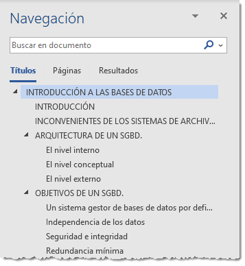

Este "índice de contenidos" aparecerá siempre que se haya realizado un esquema correcto usando los **Títulos** correctos como se indicó en el apartado [Estructura de texto](#Estructura de texto).

## 👩‍🏫Ejercicio 3

Haz un documento nuevo. Vamos a escribir un curriculum vitae. Para que todos hagamos el mismo documento, vamos a usar la información de la imagen.

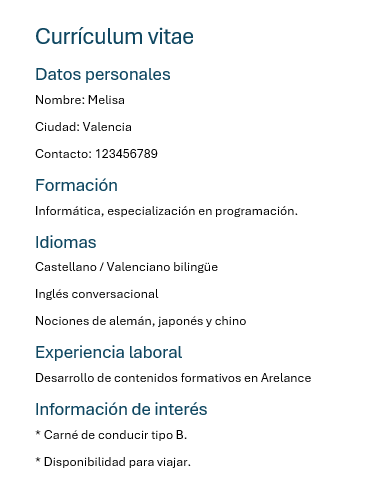

### Parte 1

1. Abre Word. Se iniciará un documento en blanco.
2. Localiza el estilo **Título 1** en la ficha Inicio. Haz clic en él y escribe **Currículum vitae** en la hoja. Luego, pulsa <kbd>INTRO</kbd> y observa que el estilo activo ahora es **Normal**.
3. Selecciona ahora el estilo **Título 2** y escribe **Datos personales**. Pulsa <kbd>INTRO</kbd>.
4. Escribe **Nombre:** y a continuación el nombre. A este texto se aplicará el estilo **Normal** por defecto. Luego, pulsa <kbd>MAYÚS+INTRO</kbd> para crear un salto de línea. Recuerda que debes pulsar primero la tecla <kbd>MAYÚS</kbd> y luego sin soltarla pulsar <kbd>INTRO</kbd>una vez.
5. Escribe **Ciudad:** y a continuación la ciudad. Luego, pulsa de nuevo <kbd>MAYÚS+INTRO</kbd> para crear un salto de línea.
6. Escribe **Contacto:** y a continuación un correo electrónico y un teléfono (inventados). Luego, pulsa <kbd>INTRO</kbd> para indicar a Word que vamos a cambiar de elemento.
7. Selecciona el estilo **Título 2** de nuevo y escribe **Formación**. Luego, pulsa <kbd>INTRO</kbd>.
8. Escribe sus estudios tal y como viene en el ejemplo. Luego, pulsa <kbd>INTRO</kbd>.
9. Selecciona el estilo **Título 2** de nuevo y escribe **Idiomas**. Luego, pulsa <kbd>INTRO</kbd>.
10. A continuación introduce los idiomas que conoce, separándolos por <kbd>MAYÚS+INTRO</kbd> de modo que quede cada uno en una línea. Para finalizar, pulsa <kbd>INTRO</kbd>.
11. Selecciona el estilo **Título 2** de nuevo y escribe **Experiencia laboral**. Luego, pulsa <kbd>INTRO</kbd>.
12. Introduce su experiencia laboral básica, tal y como hiciste con la formación. Luego, pulsa <kbd>INTRO</kbd>.
13. Selecciona el estilo **Título 2** de nuevo y escribe **Información de interés**. Luego, pulsa <kbd>INTRO</kbd>.
14. 🧐Investiga sobre como hacer las viñetas. Hay muchas formas.

### Parte 2

Una vez terminado, le añadiremos un salto de página (`Insertar` > `Páginas` > `Salto de página`) para asegurarnos que el siguiente texto siempre estará en una página aparte. En la nueva página escribimos:

> Estimados responsables de RRHH,
>
> Ya disponían anteriormente de mi currículum vitae. Sin embargo, he ampliado mis conocimientos con diversas formaciones y por ello he considerado conveniente remitirles uno actualizado. Espero que les resulte de utilidad para que puedan aprovechar todo el potencial humano que represento.
>
> Atentamente,
> Melisa.

### Parte 3

1. Si deseas realizar alguna modificación o retoque puedes hacerlo. Luego, pulsa <kbd>CTRL + G</kbd> o el botón **Guardar**. Deberás guardarlo en tu carpeta de documentos, allí donde pienses almacenar todos los ejercicios que vayas realizando. Guárdalo con el nombre que te propone, el del título, pero le añadimos el número de ejercicio: `Ejercicio 3 - Currículum vitae`. Y ya puedes cerrarlo.

## Seleccionar texto

Para realizar muchas operaciones (copiar, cambiar el formato, etc.), previamente hay que decirle a Word sobre qué parte de texto tiene que actuar; en esto consiste seleccionar. El texto seleccionado se identifica claramente porque el fondo del texto seleccionado se muestra coloreado (normalmente en gris o azul).

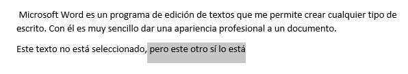

Se puede seleccionar con el ratón y con el teclado:

🟦 🖱️ **Ratón**. Para seleccionar con el ratón hay dos métodos:

> **Arrastrando**.
> \- Colocar el cursor al principio de la selección, presionar el botón izquierdo y, sin soltar el botón, mover el cursor hasta el final de la selección.
>
> **Haciendo clic y doble clic**.
> \- Colocar el cursor en una palabra y hacer **doble** **clic**: la palabra completa quedará seleccionada.
> \- Colocar el cursor justo al inicio de la línea, veremos que el cursor cambia de forma y se convierte en una flecha , hacer **clic** y la línea completa quedará seleccionada; si hacemos **doble** **clic**, el párrafo completo quedará seleccionado.
> \- Para seleccionar un **gráfico** o una imagen basta con hacer clic encima, el gráfico quedará enmarcado por un recuadro negro.

🟦 ⌨️ **Teclado**

|        Para seleccionar         |             Presione las teclas             |
| :-----------------------------: | :-----------------------------------------: |
|   Un carácter a la derecha ⭐    |     <kbd>Mayús. + flecha derecha</kbd>      |
|  Un carácter a la izquierda ⭐   |    <kbd>Mayús. + flecha izquierda </kbd>    |
|      Palabra a la derecha       |  <kbd>Ctrl + Mayús.+ flecha derecha </kbd>  |
|     Palabra a la izquierda      | <kbd> Ctrl + Mayús.+ flecha izquierda</kbd> |
|   Hasta el final de la línea.   |          <kbd> Mayús. + Fin</kbd>           |
| Hasta el principio de la línea. |         <kbd> Mayús. + Inicio</kbd>         |
|        Una línea abajo ⭐        |      <kbd> Mayús. + flecha abajo</kbd>      |
|       Una línea arriba ⭐        |     <kbd> Mayús. + flecha arriba</kbd>      |
|   Hasta el final del párrafo    |  <kbd> Ctrl + Mayús. + flecha abajo</kbd>   |
| Hasta el principio del párrafo  |  <kbd> Ctrl + Mayús. + flecha arriba</kbd>  |
|       Una pantalla abajo        |         <kbd> Mayús. + AvPág</kbd>          |
|       Una pantalla arriba       |         <kbd> Mayús. + RePág</kbd>          |
|       Todo el documento ⭐       |            <kbd> Ctrl + E</kbd>             |

⭐ Puedes empezar a usar éstas, ya que son las más útiles al inicio.

🟦 Para borrar o eliminar lo seleccionado basta con presionar la tecla <kbd>SUPR</kbd>, otra forma de borrar sin seleccionar previamente es utilizando las teclas, como se indica en la siguiente tabla:

|        Para borrar         | Presione las teclas  |
| :------------------------: | :------------------: |
| Un carácter a la izquierda | <kbd>Retroceso</kbd> |
|  Un carácter a la derecha  |   <kbd>Supr</kbd>    |

> [!TIP]
>
>  Para borrar una palabra errónea basta con hacer doble clic sobre ella para seleccionarla y pulsar la primera letra de la palabra correcta, automáticamente se borrará la palabra seleccionada y podremos seguir escribiendo en su lugar la palabra correcta.

## Deshacer y rehacer

Afortunadamente Word nos permite corregir los errores fácilmente. Si acabamos de borrar un párrafo completo y nos damos cuenta que no era ese el párrafo que queríamos borrar, no es necesario que nos llevemos las manos a la cabeza lamentando el error. Con un solo clic podemos deshacer la acción errónea y recuperar el párrafo. Veamos cómo deshacer acciones:

 🟦 **La última acción realizada**.

Para deshacer la última acción realizada, pulsar el icono **Deshacer**,  de la barra de acceso rápido.

Otra forma más de deshacer es pulsar <kbd>CTRL+Z</kbd>.

 

🟦 **Las últimas acciones realizadas**.

Si hacemos clic en el triángulo que hay a la derecha del icono deshacer , aparecerá una lista con últimas acciones para deshacer, colocando el cursor en esa lista podremos deshacer varias acciones a la vez. Por ejemplo, al colocar el cursor en la tercera línea de la lista desharemos tres acciones.

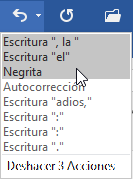

La lista nos indica de forma abreviada cuales son las diferentes acciones que podemos deshacer, por ejemplo, **Escritura "la", Escritura "el", Negrita**.

 

🟦 **Rehacer.**

Utilizando el icono **Rehacer** , de la misma forma, podemos rehacer las acciones que acabamos de deshacer. Por ejemplo, si ponemos en cursiva un párrafo y deshacemos la acción porque pensamos que no queda bien en cursiva pero al cabo de un momento pensamos que sí queda mejor en cursiva podemos rehacer la acción y volver a dejarlo en cursiva.

Otra forma de rehacer es pulsar <kbd>CTRL+Y</kbd>.

## Copiar, cortar y pegar

Cuando hablamos de copiar nos referimos a colocar una copia en otro lugar; mientras que cuando hablamos de cortar queremos decir quitar algo de un lugar para llevarlo a otro lugar.  Se pueden utilizar varios métodos, pero no vamos a explicarlos todos. Veremos el más usado y los demás los veremos poco a poco.

  

🟦 🖱️**Mediante ratón**:

Seleccionar con doble **clic**, presionar el botón derecho, elegir **copiar** o **cortar,** en el menú contextual ir a la posición donde vamos a copiar o pegar, presionar botón derecho y elegir **pegar**.

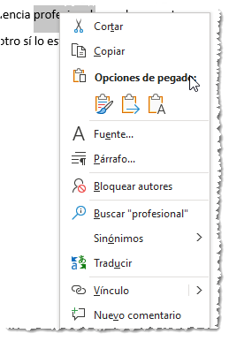

 🟦⌨️**Con el teclado**:

1. Seleccionar el texto: con <kbd>Mayúsculas+flechas</kbd>, y seleccionamos el texto que queramos.
2. Si queremos duplicar el texto, usamos <kbd>Ctrl+C</kbd> para copiarlo al portapapeles, o si queremos moverlo, cortamos con <kbd>Ctrl+X</kbd> (copia al portapapeles y después lo elimina del documento).
3. Y por último, ir a la posición donde vamos a pegar, pulsar <kbd>Ctrl+V</kbd>. 

> [!TIP]
>
> Para no equivocarte con los atajos de Copiar y Cortar, recuerda que para copiar usamos la <kbd>Control+C</kbd> (de copiar) y para cortar usamos <kbd>Control+X</kbd>, y la X simboliza una tijera ✂️.

Es aconsejable practicar todos los métodos y elegir el que nos sea más cómodo. Tener en cuenta que el método **Sólo con el teclado**, no requiere coger el ratón y, aunque parece engorroso, para las personas que teclean rápido, puede ser muy eficaz.

Cuando copiamos o cortamos, Word se lo guarda en el portapapeles, de esta forma disponemos de los últimos elementos que hemos copiado y en cualquier momento podemos volver a copiar una de ellos. También aparecen en el portapapeles otros elementos que hayamos copiado desde fuera de Word, por ejemplo, en una página web.

### Opciones de pegado

Cada vez que pegamos se copia el texto tal y como lo copiamos, con el formato que tenía. Por ejemplo, si copiamos algo que estaba en estilo negrita y tamaño 18, al pegar se pegará también en negrita y tamaño 18. Sin embargo, en ocasiones puede interesarnos que no se copie el formato ya que desentonaría en el lugar donde lo vamos a copiar. Para solucionar esto existen las **Opciones de pegado**.

¿Cómo se usan estas opciones? Debajo del icono **Pegar** aparece una flecha. Si hacemos clic en ella se despliega una lista con las opciones que puedes ver en esta imagen.

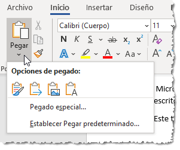

De izquierda a derecha, las opciones permiten:

- **Mantener el formato de origen** (opción predeterminada): Lo pega tal y como se copió.

- **Combinar formato**: Lo combina con el formato que haya en destino.

- **Pegar imagen**: Pega el contenido como una imagen.

- **Conservar solo texto**: Desecha cualquier estilo que haya copiado y pega solo el texto plano (sin estilo).

## Ortografía y gramática

La revisión ortográfica y gramatical es otra de las grandes aportaciones de los procesadores de texto. Word dispone de potentes herramientas en este campo que han ido mejorando notablemente en cada versión, por ejemplo, ahora disponemos de sugerencias para mejorar la claridad y concisión del texto.

Evitar que haya errores en nuestros textos es ahora mucho más fácil. No obstante conviene saber aunque Word no encuentre ningún error en la revisión no quiere decir que, necesariamente, todo sea correcto. Ya que hay errores que Word no puede detectar puesto que dependen del contexto y los algoritmos que incorpora, a pesar de ser cada vez más precisos, a veces puede escaparse algún error.

La forma que tiene Word para detectar las palabras erróneas es comprobar si las palabras de nuestro documento existen en el **diccionario** que lleva incorporado, junto con algunas **reglas gramaticales**.

La **revisión ortográfica** consiste en comprobar que las **palabras** de nuestro texto no son erróneas y la **revisión gramatical** trata de que las **frases** no contengan errores gramaticales como por ejemplo "**Los libros son buenas**"; donde no concuerdan el género del sujeto y del adjetivo.

Word ofrece distintas formas de corrección ortográfica y gramatical.

### Revisión mientras se escribe

De forma predeterminada, Word irá subrayando con una línea ondulada las palabras que considere que contienen **errores ortográficos en rojo** y las que considere que contienen **errores gramaticales en doble línea azul**. Lo hará a medida que vayamos escribiendo, sin necesidad de solicitar la revisión de forma expresa. Word no podrá detectar errores gramaticales hasta que la frase esté acabada, por ejemplo, con un punto.

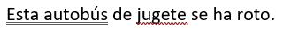

> [!NOTE]
>
> Éstas líneas son únicamente informativas, lo que significa que si imprimimos el documento, las líneas no se imprimirán.

**Para corregir el error** debemos colocar el cursor sobre palabra subrayada y **pulsar el botón derecho del ratón**. Entonces aparecerá el menú contextual que nos permitirá elegir una de las palabras sugeridas.

🟦 **Ortografía:** En este caso, para el error **jugete** nos ofrece este menú contextual.

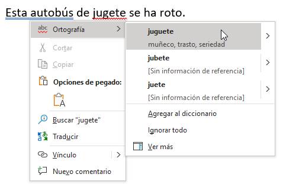

 Vemos que hay varias sugerencias para corregir el error: **juguete**, **jubete** y **juete**. Deberemos hacer clic sobre la que nos interese. Tenemos varias opciones:

- **Seleccionar la palabra correcta** de la lista de sugerencias.
- **Agregar la palabra "incorrecta" al diccionario:** Añade la palabra subrayada al diccionario personalizado y no la volverá a mostrar como un error. Podemos agregar palabras al diccionario si estamos seguros de su existencia. Por ejemplo, términos científicos que no suelen estar contemplados. O bien, por motivos prácticos. Si utilizamos constantemente el nombre de nuestra empresa (Arelance) y siempre presenta problemas, lo más práctico es incluirlo en el diccionario, para no tener que omitirlo en cada uno de los documentos.
- **Ignorar todo**: En ocasiones el corrector se equivoca, o simplemente estamos utilizando nombres propios o marcas comerciales que no están incluidos en el diccionario. En tal caso, deberemos ignorar el error en todo el documento.
- **Ver más**: Abre una ventana de opciones avanzadas.

🟦 **Gramática:** En nuestro ejemplo sólo ofrece una sugerencia de corrección: **Este autobús**, ya que parece que la solución está clara.

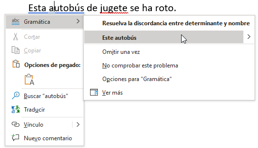

Al igual que antes, tenemos varias opciones:

- **Omitir una vez**, hace que no se considere el error en esta ocasión, pero sí, si vuelve a aparecer.
- **No comprobar este problema** hace que no se vuelvan a mostrar errores de este tipo, por ejemplo en este caso del tipo "discordancia entre determinante y nombre".
- **Opciones para "Gramática"** abre una ventana con las diferentes opciones que se aplican a la revisión gramatical.
- **Ver más**: Abre una ventana de opciones avanzadas.

## 👨‍🏫Ejercicio 4

En este ejercicio practicaremos cómo **corregir errores ortográficos y de gramática durante la redacción de un texto**.

1. Abre Word. Se iniciará un documento en blanco. Teclea el siguiente texto, incluidos los errores:

   > 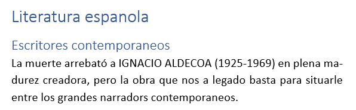

2. Al final de cada una de las frases, para un momento a observar las palabras subrayadas con la marca de error ortográfico.

3. Haz clic con el botón derecho del ratón sobre cada una de las palabras erróneas. En el menú contextual encontrarás, en primer lugar, algunas sugerencias para la corrección. En cada caso deberás hacer clic sobre aquella que consideres más adecuada.
   Es decir, deberás escoger **española**, **contemporáneos** y **ha**, que son algunas de las opciones que se muestran. En **narradors** en cambio hay varias opciones, deberás escoger **narradores**.

4. Guarda el documento con el nombre **Ejercicio 4 - Ignacio Aldecoa**.

5. Cierra Word.

### Panel Editor

Como hemos visto en el punto anterior, por defecto, Word revisa el texto mientras escribimos pero si no queremos ir cambiando cada una de las palabras manualmente, podemos desactivar la revisión automática y recurrir a forzar la revisión una vez hayamos terminado de escribir. 

Lo podemos hacer desde el comando **Editor**, este comando está accesible de varias formas, la más simple es desde la pestaña **Inicio** > grupo **Editor** > opción **Editor**.

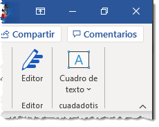

Word comenzará a efectuar la revisión ortográfica y cuando encuentre un posible error se detendrá y lo mostrará en el panel **Editor**. Este panel mostrará tanto los errores de ortografía como los de gramática, así como la sección de **Mejoras**. En la siguiente imagen vemos el aspecto del panel **Editor**.

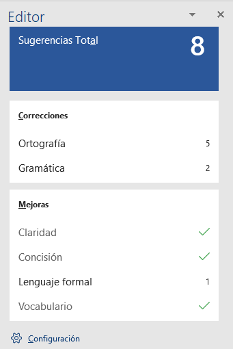

Como vemos en la imagen, en este ejemplo, el panel **Editor** nos ofrece 8 **sugerencias** en total, que se dividen entre las partes del panel:

- **Correcciones**:
  - Ortografía
  - Gramática
- **Mejoras**:
  - Claridad
  - Concisión
  - Lenguaje formal
  - Vocabulario

🟦 **Correcciones**: Nos muestra un resumen de los errores ortográficos y gramaticales, pudiendo acceder a ellos y solucionarlos de una manera efectiva.

🟦 **Mejoras**: Como su nombre indica, estas mejoras **no son errores** sino sugerencias para mejorar el estilo del documento para que sea más claro, conciso, rico en vocabulario y utilice un lenguaje más formal, veamos un ejemplo de este último.

Como muestra la siguiente imagen, Word nos sugiere cambiar "los mismos" por "estos", lo cual es un pequeño cambio que Word clasifica como lenguaje formal. Si leemos la frase completa podemos estar de acuerdo o no con Word, y por lo tanto, aceptar la sugerencia o dejarlo como estaba. En este caso, no hay demasiada diferencia entre una opción y la otra, yo lo dejaría como estaba.

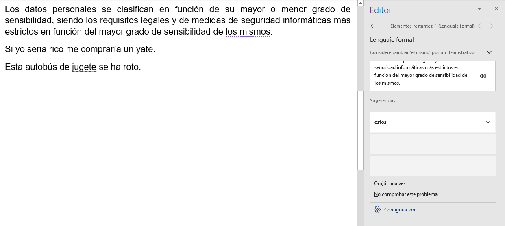

Si la descripción de la sugerencia no está muy clara para el usuario, se puede desplegar una explicación más amplia con el botón de la derecha de la descripción, para nuestro ejemplo se vería esta descripción más larga.

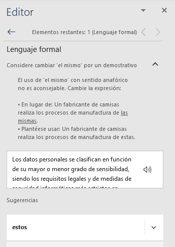

🟦 Una vez finaliza la revisión de todo el documento, se muestra un mensaje de aviso como el siguiente:

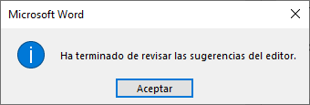

### Autocorrección

Mediante la autocorrección Word puede corregir algunos errores obvios sin previo aviso, también nos ofrece la posibilidad de crear nuestras propias correcciones.

Por ejemplo, si detecta que escribes **o once**, lo cambiará automáticamente por **u once**. O bien, si detecta que empiezas una frase con minúscula, la cambiará por mayúscula. También acentuará las palabras de forma automática.

> [!WARNING]
>
> Aunque parezca una forma muy cómoda de automatizar la corrección, es un arma de doble filo ya que en ocasiones Word cambiará automáticamente una palabra sin que nos demos cuenta.

### Diccionario de sinónimos

Además de la corrección de textos, Word consigue facilitar nuestro trabajo a la hora de la redacción y ayudarnos a crear documentos de bien elaborados. Para ello, nos ofrece un diccionario de sinónimos en `Revisar` > `Sinónimos`.

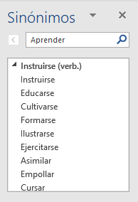

Tiene su apartado especial en la cinta de opciones pero en general es más cómodo utilizar el **menú contextual**, porque al seleccionar una palabra y hacer clic con el botón derecho del ratón tendremos a nuestro alcance la opción **Sinónimos**.

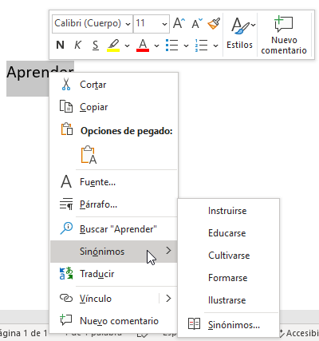

---

# 3. Formato

Cuando hablamos del formato de un documento nos estamos refiriendo a las cuestiones que tienen que ver con su aspecto, con la forma de presentarlo. El contenido en sí seguirá siendo el mismo.

**La presentación del documento es importante**. No sólo por elegancia, sino también para facilitar y motivar su lectura. Afortunadamente, Word facilita mucho esta tarea y con poco trabajo se consiguen resultados espectaculares.

## Temas

Como recordarás, al definir cada texto con un estilo desde la pestaña **Inicio** > grupo **Estilos**, indicamos a Word qué parte es un título (Título1), qué parte un subtítulo (Título2..3..4...etc.) y cuál es el párrafo que compone el cuerpo, entro otros elementos. Es decir, a través de la aplicación de estilos, definimos la estructura del documento.

Un **tema** es la aplicación de distintos formatos sobre cada uno de los **estilos predefinidos** (Título1, Titulo2, ...) y algunos otros elementos que componen el documento, fundamentalmente el **tipo de letra** (fuente) y la **portada**. 

En un tema, por ejemplo, se define que todos los títulos serán de un determinado color, con un determinado tamaño y una determinada tipografía. Y así con los otros elementos del tema. De este modo que no importa lo extenso que sea el documento, porque si hemos aplicado correctamente los estilos se cambiará su formato por completo con un único clic.

Existen varios temas predeterminados, puedes aplicarlos desde la pestaña **Diseño** > grupo **Formato del documento** > opción **Temas**.

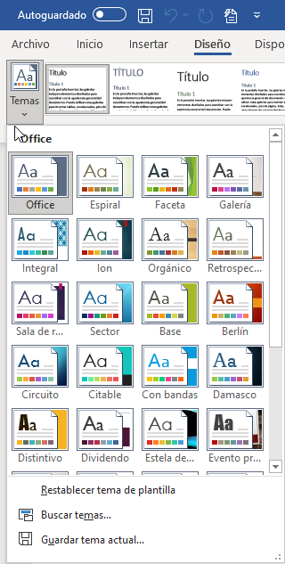

Por defecto se utiliza el tema **Office**, pero ya ves que dispones de una larga lista de opciones (observa que puedes ver más bajando la barra de desplazamiento). 

🟦 Con mover el ratón por encima de los temas, se previsualizarán los cambios en tu documento y así podrás hacerte una idea de como quedarían. 

🟦 Para aplicar el tema definitivamente, haz clic con el botón izquierdo sobre el tema elegido y listo.

> [!TIP]
>
> 🤓Si no hay ninguno que se ajuste a tu gusto, siempre puedes crear **temas personalizados**.

## Portada

En ocasiones el tipo de documentos que realizamos necesitan de una **portada**: proyectos, memorándums, informes... Word facilita mucho esta tarea, ya que pone a nuestra disposición una serie de portadas predefinidas.

Para incluir una portada debemos ir a la pestaña **Insertar** > grupo **Páginas** > opción **Portada**.

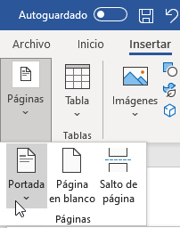

Se desplegará un menú con varios diseños. Haciendo clic en uno de ellos se insertará una nueva página al principio del documento con el aspecto elegido.

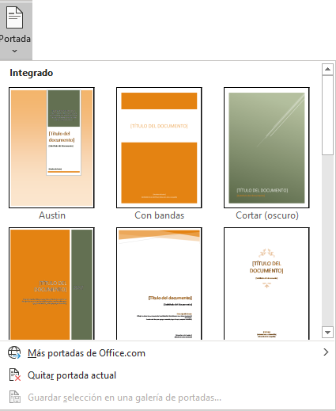

> [!TIP]
>
> Recuerda que aquí se incluye también el botón para eliminar la portada al documento. Normalmente para quitarla se suele dar más vueltas de la cuenta 😵‍💫.

La portada suele incluir cuadros que deben rellenarse con los datos adecuados, como el título, el subtítulo, la fecha o el nombre del autor. De entrada, estos campos se muestran con texto entre corchetes: [Escribir el título ...]. Al hacer clic sobre él se muestra un **cuadro de edición**, donde hay que indicar el nuevo texto.

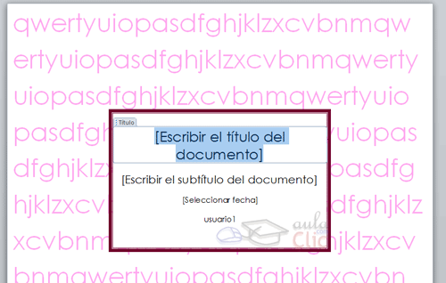

Ten presente que las portadas, al igual que el resto del documento, se ven influenciadas por el tema aplicado al documento. Es decir, que el aspecto variará ligeramente para adaptarse a los colores y fuentes del tema en cuestión y así dar un aspecto al conjunto más homogéneo.

## 👨‍🏫 Practicar

Si quieres practicar con la portada y los temas, abre un ejercicio anterior, añádele una portada y prueba a juguetear con los temas.

## Formato de texto

Cuando hablamos de fuente nos referimos a la **forma en que se representan cada una de las letras, números y signos de puntuación que se escriben como texto**.

Como hemos visto se puede dar un estilo diferente a las fuentes del documento a través de los temas y estilos. Pero en este apartado aprenderemos a realizar estos cambios de forma manual y precisa, para poder, por ejemplo, aplicar un formato distinto a un texto en concreto.

En versiones más antiguas de Word se utilizaban estas herramientas de forma exclusiva para formatear todo el texto. Ésto suponía mucho tiempo y esfuerzo para lograr un resultado profesional. Afortunadamente con la posterior aparición de herramientas útiles que facilitan el trabajo, como los estilos y los temas, éstas se pueden utilizar para perfeccionar y ajustar los estilos en casos más concretos.

Podemos modificar la fuente desde la pestaña **Inicio** > grupo **Fuente**.

También aparecen las herramientas de formato automáticamente al seleccionar una palabra o frase.

Vamos a comentar las herramientas más importantes de estos paneles.

🟦**Fuente**: De forma común, al hablar de cambiar la fuente o aplicar una fuente nos referiremos a elegir la tipografía. En la imagen vemos que la **tipografía** de fuente actual es **Calibri**. Haciendo clic sobre el pequeño triángulo que hay a su derecha se despliega el listado de fuentes disponibles en nuestro equipo.

Observa que el propio nombre de la fuente está representado en ese tipo de fuente, de forma que podemos ver el aspecto que tiene antes de aplicarlo.

🟦 **Tamaño de la fuente**

De forma parecida podemos cambiar el tamaño de la fuente. Seleccionar el texto y hacer **clic** en el **triángulo** para buscar el tamaño que deseemos, o **escribirlo** directamente en la caja de texto.

La unidad de medida es el punto (72 puntos = 1 pulgada = 2,54 cm), los tamaños más utilizados son 10 y 12 puntos.

Junto al desplegable de tamaño de fuente veremos dos botones en forma de **A**  que también nos permiten seleccionar el tamaño de fuente, pero esta vez de forma relativa. Cada uno de ellos tiene una flecha triangular: el de la flecha hacia arriba aumenta el tamaño, y el que apunta hacia abajo lo disminuye.

🟦 **Efectos básicos:**

Existen herramientas de estilo que nos permiten realizar cambios sobre un texto.

Basta **seleccionar el texto y hacer clic** en el botón correspondiente. Al activarse la opción se muestra el fondo gris. Para desactivarlo se sigue el mismo proceso. Como puedes apreciar en la imagen , se pueden activar varios a la vez.

-  **Negrita** (teclas <kbd>CTRL+B</kbd>): Aumenta el grosor de la línea que dibuja los caracteres.
-  **Cursiva** (teclas <kbd>CTRL+I</kbd>): Inclina el texto ligeramente hacia la derecha.
-  **Subrayado** (teclas <kbd>CTRL+U</kbd>): Dibuja una línea simple bajo el texto. Si pulsas la pequeña flecha triangular de su derecha se despliega un menú que te permite cambiar el estilo de la línea, pudiendo elegir entre líneas onduladas, discontinuas, dobles, gruesas, etc.
-  **Tachado**: Dibuja una línea sobre el texto.
-  **Subíndice**: Reduce el tamaño del texto y lo sitúa más abajo que el resto del texto.
-  **Superíndice**: Reduce el tamaño del texto y lo sitúa más arriba que el resto del texto.

> [!NOTE]
>
> Subíndice y superíndice son los únicos estilos que no se pueden aplicar a la vez. Porque, obviamente, el texto se posiciona arriba o abajo, pero no en ambos sitios a la vez. O estamos a setas o estamos a Rolex.

🟦 **Colores del texto:** Para dar algo de **color** al texto, utilizamos las herramientas  que también se pueden aplicar a la vez. Están en la pestaña **Inicio** > grupo **Fuente** y desde el menú contextual.

-  **Color de fuente**: Es el color del texto. La línea que se dibuja bajo la letra **A** del icono es el color que hay seleccionado actualmente. También dispone de una paleta de colores que se muestra al pulsar su correspondiente flecha.

-  **Color de resaltado del texto**: Al pulsar sobre este botón el cursor cambiará y tomará la forma de un rotulador de resaltado. Colorea el fondo del texto del color indicado, del mismo modo que resaltaríamos sobre una hoja de papel con un rotulador. 

  Para cambiar el color, pulsa la flecha de la derecha y selecciona cualquiera de la paleta de colores disponibles.

  

  Si lo que quieres es quitar el resaltado, selecciona el texto y pulsa **Sin color**. Para dejar el texto resaltado pero dejar de utilizar el lápiz especial y recuperar el formato normal del cursor, pulsa **Detener resaltado**.

-  **Efectos de texto**: Al pulsar sobre la flecha de efectos se despliega un menú con 20 formatos prediseñados que incluyen sombreados, reflejos, letras con bordes de un color distinto al fondo, y demás efectos.

  

  

## WordArt

Con las opciones anteriores seríamos perfectamente capaces de crear un rótulo vistoso en nuestro documento. Pero Word dispone de una herramienta que permite **crear rótulos** de forma sencilla, escogiendo de entre los formatos predefinidos existentes: **WordArt**.

Para utilizarla, iremos a la pestaña **Insertar** > grupo **Texto** y pulsaremos el botón **WordArt**.

Se mostrará una lista con algunos modelos de letras. Lo único que deberemos hacer es hacer clic sobre la que más nos guste.

A continuación se mostrará un texto en el documento listo para ser modificado. Si hemos seleccionado texto previamente no será necesario teclearlo ya que aparecerá ya escrito.

Recuerda que puedes retocar el texto con las herramientas de la pestaña **Inicio** para cambiar aspectos como la fuente, el tamaño, el color o los estilos, tal y como lo harías con cualquier otro texto.

Sin embargo, los elementos WordArt no son exactamente texto, sino que están a medio camino de ser imágenes. Por ello, vemos que cuando lo tenemos seleccionado disponemos de la pestaña **Formato de forma**. Esto quiere decir que, por ejemplo, el texto WordArt seguirá las reglas de alineación de los gráficos.

En la parte izquierda hay un **ancla** que sirve para mover el texto de sitio, en la parte superior central está el icono para **girar** y en la parte derecha el icono para **alinearlo** con el texto que lo rodea.

Normalmente, el texto Wordart se utiliza para rótulos, títulos, portadas, etc.

## Alineación del párrafo

Para cambiar las características de formato de un párrafo, basta con seleccionarlo y modificar las características que queramos.

Los párrafos son **unidades** dentro del documento Word que tienen sus propias características de formato, pudiendo ser diferentes de un párrafo a otro. Otras unidades más amplias son las **secciones**, que veremos más adelante.

Las características más importante de formato de párrafo son la **alineación** y la **sangría**, ambas están disponibles en la pestaña **Inicio**.

🟦 **Alineación**: Estos son los botones  para fijar la alineación. Hay cuatro tipos de alineación:

| Izquierda                                            |                        Centrada                        |                                            Derecha |                         Justificada                          |
| :--------------------------------------------------- | :----------------------------------------------------: | -------------------------------------------------: | :----------------------------------------------------------: |
| Este párrafo tiene establecida alineación izquierda. | Este párrafo tiene establecida la alineación centrada. | Este párrafo tiene establecida alineación derecha. | 
Este párrafo tiene una alineación justificada.
 |

Cuando hablamos de alinear un párrafo nos referimos, normalmente, a su alineación respecto de los márgenes de la página, pero también podemos alinear el texto respecto de los bordes de las celdas si el texto se encuentra en una tabla.

🟦 **Sangría**: Aplicar una sangría a un párrafo es desplazar un poco el párrafo hacia la derecha o izquierda. Se realiza seleccionando el párrafo y haciendo clic en uno de estos botones  de la pestaña Inicio en el grupo **Párrafo**, según queramos desplazar hacia la izquierda o hacia la derecha.

Así desplazamos el párrafo **1,25 cm**. cada vez que hacemos clic en el botón, pero también se puede desplazar otro valor que deseemos. Puedes ver cómo se hace, junto con otras opciones de la pestaña **Inicio**, como la forma de variar el espacio que separa los párrafos, y el espacio que separa las líneas o interlineado.

> [!CAUTION]
>
> 🚧Se recomienda no cambiar la sangría hasta no tener un conocimiento más avanzado, ya que es bastante fácil "romper" el documento y complicar el volver a su estado original.

## Viñetas y listas numeradas

En el grupo **Párrafo** de la pestaña **Inicio** también encontramos herramientas para crear listas. 

Una lista no es más que un conjunto de elementos ligeramente tabulados y precedidos por un símbolo, dibujo o número. Utilizaremos una lista numerada o por viñetas dependiendo de si los elementos guardan o no un orden secuencial. Para aplicarlas, podemos:

- Pulsar el correspondiente botón y empezar a escribir cada uno de los elementos de la lista.
- O bien seleccionar un texto ya existente y aplicar el estilo de lista.

Para elegir el **estilo de lista**, lo único que hay que hacer es desplegar la flecha triangular situada a la derecha de cada uno de los botones.

## 👩‍🏫Ejercicio 5

En este ejercicio practicaremos cómo **aplicar y modificar listas**.

1. Abre Word. Trabajaremos sobre el archivo en blanco.
2. En la pestaña **Inicio**, selecciona el estilo **Título 1** y escribe **Lo que llevar en la maleta** y pulsa <kbd>Intro</kbd>.
3. En **Inicio** > **Párrafo**, haz clic en la herramienta **Viñetas**. Aparecerá un círculo negro en el documento.
4. Escribe **Ropa** y pulsa <kbd>Intro</kbd>. Aparecerá un círculo idéntico al anterior bajo él.
5. Pulsa el botón **Aumentar sangría** para indicar que vamos a introducir elementos dependientes de **Ropa**. Se encuentra en el grupo **Párrafo** de la ficha **Inicio**, junto a las listas.
6. Escribe **Ropa interior** y pulsa <kbd>Intro</kbd>. Repite la operación para los elementos: **Ropa de abrigo**, **Vestido de fiesta**, **Zapatos de fiesta**, **Zapatos cómodos**.
7. Tras escribir el último elemento y pulsar <kbd>Intro</kbd>, queremos introducir otro elemento al mismo nivel que **Ropa**, así que pulsa el botón **Disminuir sangría**.
8. Escribe **Higiene** y pulsa <kbd>Intro</kbd>.
9. Pulsa **Aumentar sangría** e introduce los elementos **Pasta de dientes**, **Cepillo de dientes**, **Peine**, **Champú**, **Gel**, **Desodorante**, **Toalla**. Por supuesto, tras cada uno de ellos deberás pulsar <kbd>Intro</kbd>.
10. Tras el último <kbd>Intro</kbd>, pulsa **Disminuir sangría** y escribe el texto **Otros**.
11. Pulsa <kbd>Intro</kbd> y luego **Aumentar sangría**.
12. Escribe **Paraguas**, **Cargadores**, **GPS**, separados por la tecla <kbd>Intro</kbd>. Pulsa dos veces la tecla <kbd>Intro</kbd> para salir de las viñetas. El resultado hasta el momento deberá ser el siguiente:
    
13. Haz clic justo en el círculo negro de una de las viñetas en forma de círculo negro. Observarás que se seleccionan en color gris todas las viñetas del mismo nivel.
14. Haz clic sobre la pequeña flecha triangular de la herramienta **Viñetas** para desplegar su menú. En él debes seleccionar otro estilo de viñeta distinto. Elige el que más te guste de la **Biblioteca de viñetas**.
15. Selecciona ahora una de las viñetas del subnivel para seleccionarlas todas y repite la operación, pero esta vez selecciona la viñeta en forma de cuadrado negro. El resultado será el siguiente:
    
16. Guarda el documento con el nombre **Ejercicio 5 - Listas y viñetas** y ciérralo.

---

# 4. Imprimir

Para imprimir un documento podemos pulsar las teclas <kbd>Control+P</kbd> o bien ir a la pestaña **Archivo** y seleccionar **Imprimir**. En la pantalla verás las opciones de impresión, tal y como se muestra en la siguiente imagen.

 

A la derecha podrás ver una vista previa del documento tal y como se imprimirá. Si te gusta el resultado será suficiente con pulsar el botón **Imprimir** y ya dispondrás de tu copia impresa. Eso es todo.

---

# 5. Tablas

## Crear tablas

Una tabla está formada por **celdas** o casillas, agrupadas por **filas** y **columnas**. En cada celda se puede insertar texto, números o gráficos.

Las tablas permiten organizar la información en filas y columnas, de forma que se pueden realizar operaciones y tratamientos sobre los datos. Por ejemplo, obtener el valor medio de una columna u ordenar una lista de nombres.

Otra utilidad de las tablas es su uso para mejorar el diseño de los documentos ya que facilitan la distribución de los textos y gráficos contenidos en sus casillas.

Las tablas son una forma de organizar los datos mucho más potente que utilizando las tabulaciones u otros métodos ya que permiten realizar operaciones aritméticas sobre los datos numéricos de las filas y columnas.

Para **crear una tabla** accedemos siempre desde la pestaña **Insertar** > grupo **Tablas** > botón **Tabla**. Allí encontraremos las tres posibles formas de crear tablas, como muestra la siguiente imagen

1. **Usar la cuadrícula que simula una tabla**. Cada cuadrado representa una celda y al pasar el ratón sobre ella se coloreará en naranja la selección que realicemos. Al hacer clic confirmamos que la selección se ha realizado y se inserta la tabla en el documento. En el ejemplo de la imagen estaríamos creando una tabla de 3x3.

    

 2. **Insertar tabla**: Se abre una ventana que permite **especificar el número** de filas y columnas para la tabla.

    

 3. **Dibujar tabla:** El cursor tomará forma de lápiz y simplemente iremos dibujando las líneas que la formarán. Esta opción es más lenta, pero puede resultar muy útil para crear **tablas irregulares** o para retocar tablas ya existentes.

    

Para **retocar una tabla** dibujando sus bordes deberemos situarnos en ella. De este modo veremos que se abre la pestaña de **Diseño de tabla**, en el grupo **Bordes**, encontraremos las herramientas que nos ayudarán a dar el diseño deseado a la tabla.

 

Podemos elegir el **estilo**, **grosor** y **color** del borde y el cursor tomará forma de pluma para que modifiquemos el diseño de los bordes de la tabla.

Si queremos modificar la estructura de la tabla iremos a la pestaña de **Disposición,** grupo **Dibujar**, y a continuación pulsar sobre **Dibujar tabla** .

Si nos equivocamos podemos utilizar la herramienta **Borrador**, que cambiará el dibujo del cursor y nos permitirá eliminar cualquier línea de la tabla simplemente haciendo clic sobre ella.

## 👨‍🏫Ejercicio 6

Crearemos una tabla básica:

1. Crea un nuevo documento en blanco en Word. 
2. Inserta una tabla nueva.
3. Rellena los datos de la tabla e intenta que se parezca lo más posible a la siguiente imagen.
	

4. Guarda el documento con el nombre de `Ejercicio 6 - Tablas` y cierra Word.

## Aplicar estilos a las tablas

Podemos aplicar estilos predefinidos **con un sólo clic**, eligiéndolos en la pestaña **Diseño de tabla** > grupo **Estilos de tabla**.

Al pasar el ratón sobre ellos verás cómo cambia el formato de la tabla. Para aplicarlo definitivamente haremos clic sobre él. Luego, podrás retocar el resultado final, si lo deseas, con las herramientas de **Sombreado** y **Bordes**.

Además, los estilos se pueden ajustar según nuestra conveniencia en base a distintas opciones que tenemos disponibles justo a su derecha. Podemos elegir pues si nuestra tabla tiene o no encabezados, filas de totales o las filas y columnas resaltadas en distintos colores que van alternando. Para ello simplemente deberemos marcar o desmarcar cada una de las **Opciones de estilo de tabla**.

## Combinar y dividir

En ocasiones no querremos insertar ni eliminar celdas, sino combinarlas de forma que, por ejemplo, una fila contenga una única celda que ocupe lo mismo que las del resto de filas. O bien para conseguir el efecto totalmente opuesto, que una celda se divida en dos o más celdas sin afectar al resto.

Para conseguirlo, utilizamos las opciones de la pestaña **Disposición** > grupo **Combinar**.

- El botón **Combinar celdas** sólo estará activo si hay más de una celda seleccionada en la tabla. Esto es así, obviamente, porque antes de nada debemos indicar cuáles queremos combinar.

- **Dividir celdas** mostrará una ventana donde especificar en cuántas secciones dividir la celda seleccionada. El ejemplo anterior mostraba una división en dos columnas y una fila, pero perfectamente podríamos haber realizado una división horizontal en dos filas y una columna.

- Por último, **Dividir tabla** separará la tabla en dos, siendo la primera fila de la segunda tabla aquella que se encuentre seleccionada o con el punto de inserción.

## 👨‍🏫Ejercicio 7

Vamos a crear una tabla un poco más compleja:

- En este ejercicio no te daremos los pasos detallados. Tendrás que hacerlo por tu cuenta. 

- Intenta hacerlo parecida, pero no hace falta que sea exactamente igual. Puedes elegir los colores o la tipografía que más te guste.

- Se recomienda que primero crees la tabla y la rellenes. Una vez rellena, puedes empezar a darle formato.

- Todas las celdas de la fila RECREO están combinadas, excepto la hora.

- El recreo está realizado con WordArt. Investiga y prueba.

- Prueba a centrar los textos dentro de la celda, horizontal y verticalmente.

- ¿Como estará hecho lo de la última hora del viernes? 💡Una pista, *bordes*.

- Una vez terminado, haz una copia de la tabla para tenerla dos veces y no destrozar nuestro trabajo anterior.

- A la segunda copia, prueba a darle un color a cada asignatura (por ejemplo, Matemáticas, Lengua). Hay que darle color a la celda, no usar la opción de resaltado de texto.

  

  

---

# 6. Imágenes

## Introducción

En la mayoría de casos, nuestro documento se verá muy enriquecido si incorpora fotografías, gráficos, vídeos y cualquier otro objeto que apoye su contenido con material más visual. Por eso cada nueva versión de Word se ocupa de ir mejorando las herramientas de ilustraciones, facilitando su inserción, retoque y ajuste.

> [!IMPORTANT]
>
> Antes de continuar, es importante aclarar estos conceptos:
>
> - **Imagen Vectorial**: Una imagen vectorial está compuesta por objetos geométricos independientes, como segmentos o polígonos. Estos objetos se definen mediante atributos matemáticos que indican su color, posición, etc. No tienen pixeles, por lo que se pueden ampliar "infinitamente" sin perder definición. Su extensión suele ser `SVG`.
> - **Imagen Bitmap**: Las imágenes Bitmap están compuestas por píxeles, que son puntos de color muy pequeños. Estos píxeles se agrupan para formar la imagen. Todas las fotografías en Internet son Bitmap. Sin embargo, cuando haces zoom en una foto, pierde calidad y se ven los píxeles como pequeños cuadrados. Las imágenes vectoriales, en cambio, se basan en fórmulas matemáticas y no se dividen en unidades mínimas de información como los píxeles. Su extensión suelen ser `JPG`, `JPEG` , `GIF`, `BMP`, `PNG`.

Las herramientas que tiene Word se encuentran en la pestaña **Insertar** > grupo **Ilustraciones**:

Vamos a describirlas brevemente:

🟦**Imágenes**. Inserta una imagen o foto guardada en el disco. Pueden ser imágenes fotográficas procedentes de móviles o cámaras digitales, de Internet, de programas como Photoshop, Gimp, Fireworks, PaintShopPro, etc. Suelen ser de tipo JPG, GIF o PNG. Sobre estas imágenes se pueden realizar algunas operaciones como cambiar el tamaño, el brillo,..., pero no se pueden desagrupar en los elementos que las forman. Estas imágenes admiten cambios de tamaños, pero en ocasiones, si las reducimos y posteriormente intentamos ampliarlas de nuevo pueden perder resolución. Cuando hablemos de imágenes, en general, nos estaremos refiriendo a este tipo de imágenes **no vectoriales**.

🟦**Formas**. Mediante autoformas, líneas, rectángulos, elipses, etc. Estos gráficos son **imágenes vectoriales**, es decir, la imagen está descrita matemáticamente por vectores, por lo cual pueden ampliarse y reducirse sin perder resolución.

🟦**Iconos**. Son gráficos esquemáticos de variados temas y alta calidad. Los iconos también son **imágenes vectoriales**.

🟦**Modelos 3D**. Son objetos 3D, que al ser tridimensionales, podemos manipularlos para presentarlos desde cualquier ángulo.

🟦**SmartArt**. Representación de datos en forma de organigramas.

🟦**Gráfico**. Representación de datos en forma de gráficos de barra, de pastel, etc.

🟦**Captura**. Son trozos de la pantalla capturadas por el usuario.

## Insertar imágenes en línea

Si hacemos clic en en la pestaña **Insertar** > grupo **Ilustraciones** > **Imágenes** aparecen las tres opciones que muestra esta imagen:

Vamos a ver las tres opciones pero en orden inverso. Si hacemos clic en **Imágenes en línea**, se abrirá una ventana para que puedas buscar imágenes en Internet utilizando el buscador de Microsoft **Bing**, como muestra la siguiente imagen.

Inicialmente se nos muestra una pantalla con diversas categorías de imágenes ( Avión, Animales, ...) si pulsamos sobre una categoría, por ejemplo, **Animales**, se realizará una búsqueda utilizando esa palabra clave, aunque lo más probable es que queramos hacer una búsqueda tecleando nuestra propia palabra clave en la caja de búsqueda, por ejemplo, Perros, en ambos casos aparecerá una pantalla de siguiente tipo:

> [!WARNING]
>
> Es importante respetar los derechos de autor de las imágenes que descarguemos de Internet

## Insertar imágenes de archivo

En la pestaña **Insertar** > grupo **Ilustraciones** > **Imágenes** aparecen tres opciones.

Si hacemos clic en la opción **Imágenes de archivo**, se abrirá una ventana similar a la siguiente.

 

Desde aquí podemos insertar **Imágenes**, **Iconos**, **Personas recortadas**, **Adhesivos** e **Ilustraciones** procedentes de un banco de imágenes de Microsoft. En versiones anteriores de Word a esta opción se la llamaba **Imágenes prediseñadas**.

Para cada tipo de imagen se muestran unas categorías, por ejemplo, para **Imágenes**, tenemos **Nuevo**, **Saludable**, **Cielo**, etc.

Según el tipo de versión de Word que estemos usando, esta opción contendrá más o menos imágenes, para Word 365 tendrá todas las imágenes disponibles.

Podríamos decir que esta opción **Imágenes de archivo** es similar a la opción anterior **Imágenes en línea**, ya que también necesitamos estar conectados a Internet, aunque las imágenes proceden sólo Microsoft y son de libre uso.

## Insertar imágenes desde este dispositivo

En la pestaña **Insertar** > grupo **Ilustraciones** > **Imágenes** aparecen tres opciones (one more time).

Si hacemos clic en la opción **Este dispositivo**, se abrirá una ventana similar a la que se nos muestra cuando queremos abrir un documento Word, y que ya conocemos.

Una vez **seleccionado el archivo** que queremos incluir pulsaremos el botón **Insertar** (o pulsaremos doble clic sobre el archivo) y la imagen se copiará en nuestro documento.

En ocasiones no nos interesará que se inserte una copia de la imagen, sino vincularla para que cuando se realice un cambio en la imagen original quede automáticamente actualizada en el documento de Word. Para ello, deberemos pulsar la pequeña flecha en forma de triángulo que hay en el lateral del botón **Insertar** y seleccionar la opción **Vincular al archivo**.

## Insertar imágenes desde el portapapeles de Windows

Muchas veces será la forma más simple de insertar imágenes. Previamente las copiaremos al portapapeles con <kbd>Control+C</kbd> desde otra aplicación (Recortes, Navegador, Paint...), y en Word la podremos pegar directamente con <kbd>Control+V</kbd>.

> [!TIP]
>
> Usando la herramienta "Recortes" de Windows (<kbd>Win + Mayús + S</kbd>), toda imagen que capturemos se copiará en el portapapeles y estará lista para pegarla directamente en Word.
>
> 

## Manipular imágenes

Para modificar una imagen primero hay que seleccionarla haciendo clic en ella. La imagen quedará enmarcada por unos pequeños iconos y veremos que disponemos de diferentes comandos de imagen agrupados en la pestaña **Formato de la imagen**.

 

🟦 **Tamaño**

Los círculos que apreciamos al seleccionar la imagen, situados en las esquinas, se pueden arrastrar para modificar simultáneamente la altura y anchura de la imagen. Los círculos situados entre cada una de las esquina sirven para modificar únicamente la altura o la anchura, dependiendo de cuál arrastremos.

Otra forma de modificar el tamaño es desde la pestaña **Formato de la imagen**. Lo haremos estableciendo la altura y la anchura en centímetros.

Si lo que queremos no es redimensionarla, sino recortarla para quedarnos con sólo una parte de la imagen, también lo podremos hacer desde aquí con la herramienta **Recortar**. Al hacer clic sobre ella se dibujará un borde negro que rodea la imagen. Lo único que debemos hacer es acercar el cursor al borde y hacer clic e ir arrastrando. Veremos sombreada la zona que se va a eliminar y al hacer clic fuera de la imagen se aplicará el recorte.

🟦 **Estilos de imagen**

En el grupo **Estilos de imagen** dispondremos de un conjunto de **Estilos rápidos** para dotar a la imagen de un contorno vistoso que puede simular un marco de fotografía o aplicar sombreados y relieves.

Para ver el listado completo de estilos, haremos clic en el botón  **Más** situado al lado de los iconos de los estilos. Con los botones **Borde de imagen**, **Efectos de la imagen** y **Diseño de imagen** podremos crear un estilo personalizado o modificar el aspecto del que hayamos aplicado.

🟦 **Ajustar**

Hemos visto diversas formas de modificar sustancialmente una imagen, pero en ocasiones con unos pequeños retoques será suficiente. Puedes probar las herramientas disponibles en grupo **Ajustar**.

> [!TIP]
>
> Con **Quitar fondo** podemos dejar transparente el fondo de fotografías. Es una herramienta muy intuitiva y efectiva, y muy útil si queremos convertir en transparente una parte de una imagen, sin tener nociones de edición fotográfica.
>
> 
>
> 

## Organizar imágenes

La manipulación de imágenes en Microsoft Word puede resultar un proceso tedioso, ya que las imágenes pueden deformarse y afectar la disposición del texto. Esto puede generar frustración. Y mucha😅. Sobre todo cuando el documento empieza a acumular muchas imágenes en distintas posiciones.

A continuación, exploraremos las herramientas y opciones disponibles para abordar esta situación.

### **Organizar**

Desde la pestaña **`Formato de imagen`** > grupo **`Organizar`** podremos acceder a las herramientas que nos permiten posicionar, voltear, alinear y ajustar la imagen a su contexto.

🟦 **Posición**: ajusta la imagen respecto a la página.

🟦 **Ajustar texto:** Ajusta la imagen respecto del texto que la rodea

🟦 **Girar:** Muestra un menú con diferentes opciones de giro y volteo aplicables a la imagen.

### Accesibilidad

Con **Texto alternativo** podemos indicar un texto descriptivo sobre el contenido de la imagen. Este texto no se verá en el documento. Tiene principalmente dos utilidades:

1. Mejorar la accesibilidad del documento, ya los lectores en pantalla (un software especial) de las personas con discapacidad visual pueden leer esta información en voz alta.
2. En caso de que la imagen no pueda mostrarse por algún error, se mostrará un recuadro vacío con dicho texto.

## 👨‍🏫 Ejercicio 8

Vamos a practicar con imágenes. Para ello vamos a añadir alguna imagen a algún documento que ya tenemos hecho.

1. Abre el documento reciente del curriculum.

2. `Pestaña Inicio` > `Guardar una copia`. Y la guardamos con el nombre de `Ejercicio 8 - Imágenes`. Así tendremos una copia nueva y mantenemos el otro intacto.

3. Vamos a crear una imagen con **Inteligencia Artificial** ✨. Vamos a ir a la web https://copilot.microsoft.com. Pídele algo parecido a esto, pero con tus propias palabras: `¿Puedes generarme una imagen de una persona cualquiera aleatoria que no exista, como si fuera una imagen para un curriculum?`. Siente libre de añadirle los parámetros que quieras e intentarlo más veces si no te convencen .

   

4. Añade esa imagen al principio del documento. Puedes añadirla de muchas formas (copiar y pegar, descargarla y añadirla desde archivo, etc.).

5. Intenta que la imagen quede a la derecha del documento y los textos se sigan viendo bien.

   

6. Prueba a añadirle un estilo rápido. Por ejemplo **Rectángulo redondeado reflejado** podría venir bien. Prueba los otros.

7. Cuando termines, guarda el documento y cierra Word.

> [!TIP]
>
>  Hola, soy [Copilot](https://copilot.microsoft.com/ ). La inteligencia artificial de Microsoft. Te he ayudado en este ejercicio, pero puedo hacer otras muchas cosas como por ejemplo:
>
> - **Responder preguntas**: Estoy aquí para proporcionarte información y responder a tus consultas.
> - **Generar contenido creativo**: Puedo escribir poemas, historias, canciones, parodias de celebridades y más.
> - **Generar código**: Si tienes una tarea específica, puedo escribir y ejecutar código en muchos lenguajes de programación para resolverla.
> - **Buscar en la web**: Puedo realizar búsquedas en línea y proporcionarte resultados relevantes.
> - **Describir imágenes**: Si subes una imagen, puedo describirla para ti.
> - **Ofrecer consejos y sugerencias**: Si necesitas orientación, puedo proporcionarte recomendaciones útiles.
> - Muchas cosas más.

---

## Formas y gráficos

Word también dispone de herramientas que nos permiten **realizar nuestros propios dibujos**.

Para utilizarlas deberemos pulsar el botón **Formas** de la pestaña **Insertar**.

Selecciona la que más te guste y haz clic sobre ella.

Enseguida podrás volver al documento y ajustar sus características a tu antojo. Las formas se pueden ir agrupando en una única forma más grande, para poder moverla, redimensionarla, cambiarle los colores, etc.

## SmartArt

SmartArt es una herramienta que nos permite crear multitud de organigramas y diagramas.

**Un organigrama es un elemento gráfico que representa** **una organización,** normalmente jerárquica, por ejemplo la organización de cargos en una empresa.

Y un **diagrama es una representación gráfica que** no tiene porqué ser obligatoriamente una organización jerárquica, **puede representar** desde **un grupo de elementos relacionados entre sí** hasta un diagrama de secuencias, donde por medio de la representación gráfica se explica los pasos o componentes con una secuencia lógica, por ejemplo los pasos a seguir para poner en marcha un producto.

🟦 **Crear SmartArt**

Para insertar un diagrama debemos:

1. Acceder a la pestaña **Insertar** y seleccionar **SmartArt**.

2. Se abrirá este cuadro de diálogo, donde deberás seleccionar el tipo de diagrama que quieres insertar y pulsar el botón **Aceptar**. Nosotros para el ejemplo seleccionaremos el tipo **Jerarquía**.

 

Nos dibuja un organigrama básico de varios niveles similar al que puedes ver en la siguiente figura.

Para modificar el texto de los recuadros basta con hacer clic en su interior y escribir el texto que deseemos, o hacer clic en el botón **<** que aparece en la parte central izquierda para abrir el **Panel de Texto** que aparece en la siguiente imagen y que explicaremos más adelante.

Al insertar un organigrama nos aparecen las pestañas **Diseño de SmartArt** y **Formato**.

## 👨‍🏫 Ejercicio 9

Vamos a realizar un esquema que representa la pirámide trófica de la alimentación. Usaremos la siguiente imagen como base. Ten en cuenta que no es un documento de Word, si no una imagen de internet a la cual vamos a rehacer en Word con las herramientas que tenemos.

1. Creamos un documento nuevo.

2. Inserta un SmartArt. Busca el más adecuado. 

3. Rellena el panel de texto del SmartArt con el contenido de la pirámide de la imagen. Algo así:

   

4. ¿Qué pasa si añades un subnivel a algún elemento de la pirámide? 🤔

5. Modifica los colores de cada nivel de la pirámide.

6. Prueba a añadir **Efectos de forma** a los niveles. Aplica el que te guste.

7. Inserta **Formas** que sean una flecha. Le añades el texto que viene en la imagen. La giras. Una vez que tengas una flecha, copias y pegas y añades la otra flecha.

8. Agrupa las flechas en un mismo elemento. Le cambias los colores a las flechas (se cambiarán las dos a la vez).

9. Y listo. Tendrías que tener una pirámide super bonita 🥰. Te dejamos otra imagen como ejemplo para guiarte.

   

   

   

---

# 7. Ejercicios

Una vez terminados los ejercicios básicos, se proponen los siguientes ejercicios para poner en práctica todo lo relacionado con Word. También se incentivará la investigación de otras herramientas o utilidades que no se han visto.

## 👨‍🏫 Ejercicio 10

Vamos a crear una tabla para registrar los sitios web a los que nos vamos inscribiendo. Tendrá la siguiente forma:

1. Crea la tabla.
2. Le vas añadiendo el contenido de texto. No es necesario que sea ese, puedes ponerle el que quieras, o usar la magia de la IA ✨.
3. Le añades las imágenes, desde imágenes en línea.
4. La tabla así está muy fea. Darle formato de tabla, centra los contenidos como veas oportunos, etc.
5. Aquí hay libertad creativa total. No tendrás una imagen final como referencia. Hazla como quieras. 
6. Añade unas cuantas páginas al final con los datos que quieras.
7. Cuidado con las imágenes. Que no te descuadren la tabla. Las imágenes deben mantener su proporción (que no se deformen).

## 👨‍🏫 Ejercicio 11

1. Crea un documento nuevo.
2. Añádele una portada que tenga que ver con el contenido.
3. Crea una tabla con el siguiente contenido y darle formato que prefieras.
4. Centra los contenidos como veas oportuno, tanto verticalmente como horizontalmente.

## 👨‍🏫 Ejercicio 12

Vamos a practicar con Copiar y pegar y seleccionar textos.

1. Vamos a copiar una biografía de Brad Pitt. Para ello, vamos a buscar información en https://copilot.microsoft.com.

2. Abrimos la página y le preguntamos a Copilot sobre información de la vida de Brad Pitt, dividido en categorías como  **biografía**, **trayectoria** y **vida privada**. 

3. Copiaremos esa información y la pegaremos en un documento de Word. Tendrá el esquema siguiente:

   

## 👨‍🏫 Ejercicio 13

Intenta replicar los carteles siguientes de la forma más parecida posible.

> [!NOTE]
>
> No te preocupes si las imágenes no son exactamente iguales. Imagina que eres un presidente/a de una comunidad de vecinos y quieres hacer un cartel. Preocúpate de que no tenga errores ortográficos, que se lea bien el texto y que se entienda el mensaje que quieres transmitir.

