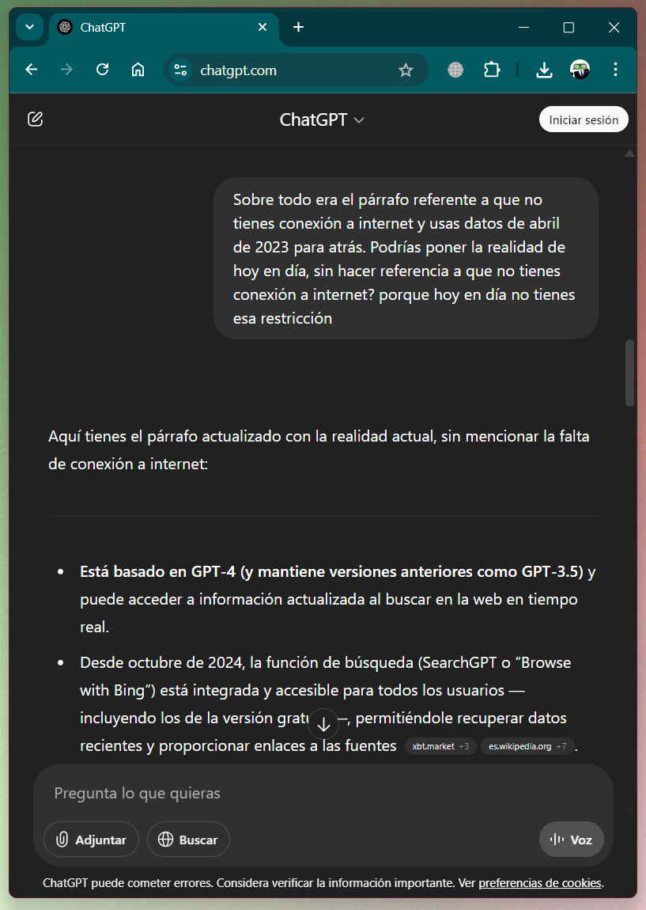
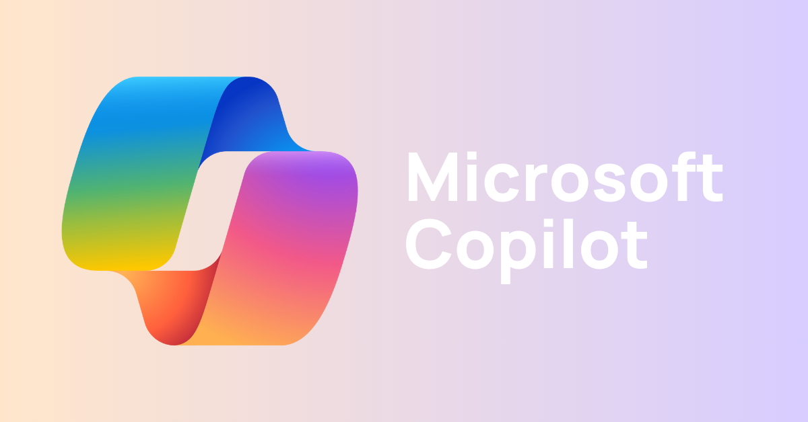
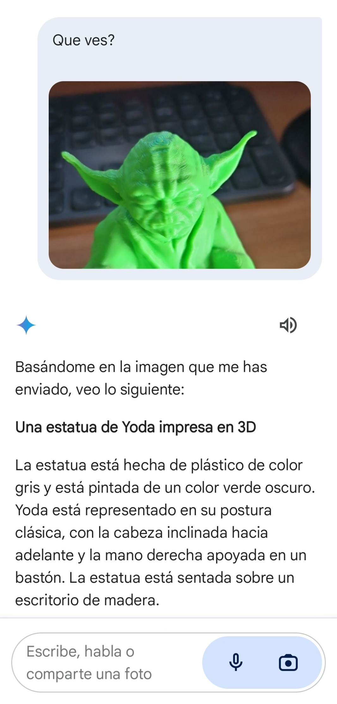
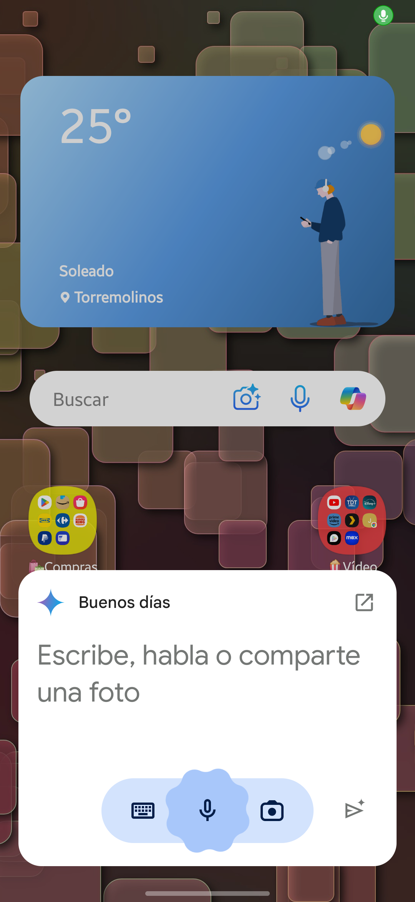

  Inteligencia Artificial

[TOC]

---

# ✨Inteligencia Artificial

La inteligencia artificial (IA) es una rama de la informática que se dedica a crear sistemas capaces de realizar tareas que normalmente requieren inteligencia humana. Estas tareas incluyen el reconocimiento de voz, la toma de decisiones, la traducción de idiomas y mucho más.

En los últimos años, la IA ha pasado de ser una tecnología experimental a estar presente en nuestro día a día: desde los asistentes virtuales en el móvil hasta los sistemas de recomendación en plataformas como Netflix o Amazon. Pero su impacto va mucho más allá del entretenimiento: está transformando la forma en que trabajamos, nos comunicamos, aprendemos e incluso cómo se toman decisiones a nivel empresarial y gubernamental.

Este avance ha generado un intenso debate sobre sus **implicaciones en la sociedad**:

- ¿La IA reemplazará millones de puestos de trabajo tradicionales?
- ¿O nos permitirá ser más eficientes y dedicar nuestro tiempo a tareas más creativas y humanas?
- ¿Nos hará más productivos… o más dependientes?
- ¿Estamos desarrollando una tecnología que mejora nuestras capacidades o que, poco a poco, nos vuelve menos críticos y autónomos?

Estas preguntas no tienen una única respuesta y son clave para entender el papel de la IA en el futuro próximo. Por eso, es importante reflexionar sobre los beneficios y riesgos que conlleva su adopción masiva.

> 💬 **Debate en clase**
>
> ¿Qué opinas tú? 
>
> ¿Crees que la IA es una herramienta que nos hará la vida más fácil, o que acabará eliminando empleos y habilidades humanas? 
>
> ¿Podría hacernos más “tontos” al delegar todo en máquinas? 
>
> ¿O más “inteligentes” al tener acceso a más información y asistencia?

## Inteligencia Artificial Generativa

La **inteligencia artificial generativa** es una rama de la IA que se centra en la **creación de contenido nuevo** y original a partir de datos existentes. Utiliza modelos avanzados de aprendizaje automático para **generar texto, imágenes, música, videos y más**. Por ejemplo, puede escribir un poema, crear una obra de arte digital o componer una melodía.

> [!TIP]
>
> ***Théâtre d'Opéra Spatial*** (Teatro de Ópera Espacial) es una pintura creada por Jason M. Allen utilizando la plataforma de Inteligencia Artificial generativa [Midjourney](https://es.wikipedia.org/wiki/Midjourney). La pintura se convirtió en noticia cuando ganó el concurso anual de bellas artes de la Feria Estatal de Colorado el 5 de septiembre de 2022, convirtiéndose en una de las primeras imágenes generadas por IA en ganar un premio.

Esta tecnología es especialmente útil en aplicaciones como los **chatbots**, la creación de contenido multimedia y el diseño de productos, ya que puede producir resultados creativos y personalizados en respuesta a las indicaciones del usuario.

Podemos destacar varios chatbots gratuitos (con modelos de pago superiores mejorados) que podemos usar para realizar tareas cotidianas y en el trabajo. De todos ellos podremos realizar las siguientes tareas (cada uno a su forma):

- **Asistencia en la redacción**: pueden ayudar a escribir correos electrónicos, artículos, informes y otros documentos, proporcionando sugerencias y completando frases.
- **Resolución de dudas**: Al igual que una búsqueda en internet, pueden responder preguntas de manera directa y concisa, ahorrando tiempo al no tener que filtrar información.
- **Aprendizaje y educación**: Puede explicar conceptos complejos de manera sencilla, lo que lo convierte en una herramienta útil para estudiantes y profesores.
- **Atención al cliente**: pueden ser utilizados en proporcionar soporte y resolver consultas comunes de los clientes de manera eficiente.
- **Traducción de idiomas**: pueden traducir textos de un idioma a otro de manera precisa.
- **Generar código:** pueden ayudarte a programar. Entienden y generan código en multitud de lenguajes de programación.
- **Aplicaciones móviles:** Todos poseen su respectiva aplicación móvil para tener todo el conocimiento en la palma de tu mano 🤓.

### Chat GPT

ChatGPT es un modelo de lenguaje avanzado desarrollado por OpenAI. Utiliza inteligencia artificial para generar texto de manera coherente y natural en respuesta a las preguntas y solicitudes de los usuarios. Actualmente está basado en la arquitectura GPT-4, aunque también ofrece versiones anteriores como GPT-3.5, y puede realizar una gran variedad de tareas relacionadas con el lenguaje y el razonamiento.

> 🤖Página web https://chatgpt.com/

- Usa GPT-4 de OpenAI (en su versión Plus), aunque también está disponible GPT-3.5.
- Puede acceder a información actualizada mediante búsqueda web en tiempo real, lo que le permite ofrecer respuestas basadas en datos recientes cuando es necesario.
- Dispone de un modo llamado *Deep Research*, que permite realizar investigaciones más profundas, con respuestas extensas, citadas y respaldadas con fuentes verificables. Este modo es ideal para trabajos académicos o tareas complejas que requieren rigor informativo.
- Puede generar imágenes a partir de descripciones escritas utilizando el modelo DALL·E, ideal para ilustraciones, conceptos visuales, diseño y creatividad.

### Microsoft Copilot

Microsoft Copilot es una herramienta de inteligencia artificial integrada en aplicaciones de Microsoft 365 como Word, Excel, Outlook, PowerPoint y Teams. Asiste a los usuarios en la redacción, análisis de datos, generación de contenido, automatización de tareas y mejora de la productividad en el entorno laboral.

> 🤖 Página web https://copilot.microsoft.com

- Utiliza el modelo GPT-4 de OpenAI, integrado a través de la infraestructura de Azure AI.
- Tiene acceso a información actualizada en tiempo real desde Bing, por lo que puede responder sobre eventos recientes o datos del momento.
- Puede generar imágenes a partir de texto mediante el modelo [Dall·E](https://es.wikipedia.org/wiki/Dall-e) 3.
- También puede interpretar y describir imágenes cargadas por el usuario, útil en presentaciones o análisis visuales.
- Está profundamente integrado en el ecosistema de Microsoft, por lo que puede trabajar directamente con tus documentos, hojas de cálculo o correos electrónicos.

### Google Gemini

Google Gemini es una plataforma de IA desarrollada por Google que se enfoca en la generación de texto y la comprensión del lenguaje natural. Es útil para obtener respuestas rápidas y precisas a preguntas específicas. Tiene la ventaja de integrarse en todo el ecosistema de aplicaciones de Google.

> 🤖Página web https://gemini.google.com/

- Tiene su propio modelo de lenguaje desarrollado por Google, llamado **Gemini**. Este modelo se basa en la familia de modelos **PaLM 2**, de Google AI, y no utiliza GPT de OpenAI.

- Puede describir imágenes.

  

- Se puede instalar como asistente de voz en un dispositivo móvil. Puedes [encontrarlo en la tienda de aplicaciones de android](https://play.google.com/store/apps/details?id=com.google.android.apps.bard).

### Perplexity

Perplexity es un asistente de inteligencia artificial centrado en la búsqueda de información con fuentes verificables. Combina modelos de lenguaje avanzados con acceso en tiempo real a internet, ofreciendo respuestas claras, concisas y siempre acompañadas de referencias. Está diseñado especialmente para quienes necesitan respuestas confiables y actualizadas rápidamente.

> 🤖 Página web https://www.perplexity.ai/

- Utiliza modelos como GPT-4 y Claude de forma integrada.
- Realiza búsquedas en internet en tiempo real y muestra las fuentes utilizadas directamente en sus respuestas.
- Ideal para estudiantes, periodistas, investigadores o cualquier usuario que necesite verificar la información de forma inmediata.
- Tiene un diseño enfocado en la simplicidad: se usa como un motor de búsqueda, pero con capacidades de lenguaje natural.
- Ofrece un modo “Pro” con respuestas más detalladas y acceso a modelos premium.

## Comparativa

| Herramienta       | Genera texto | Genera imágenes | Uso ideal                    | Precio base       |
| ----------------- | ------------ | --------------- | ---------------------------- | ----------------- |
| ChatGPT           | ✅            | ✅ (con DALL·E)  | Redacción, ideas, educación  | Gratuito / Plus   |
| Microsoft Copilot | ✅            | ✅ (con DALL·E)  | Oficina, productividad       | Con licencia M365 |
| Google Gemini     | ✅            | ✅               | Asistente móvil, Google Docs | Gratuito / Pro    |
| Perplexity        | ✅            | ❌               | Búsqueda con fuentes         | Gratuito / Pro    |
