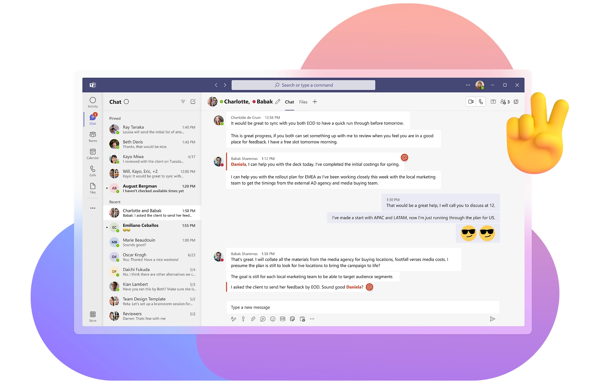
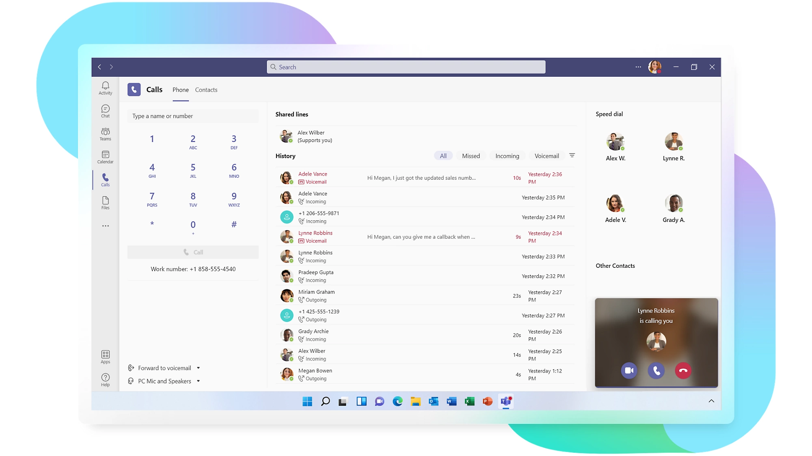
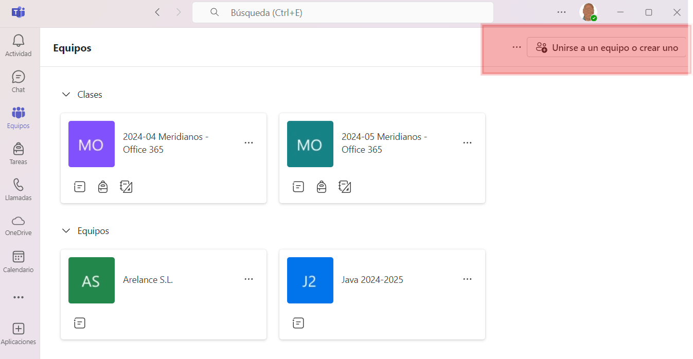
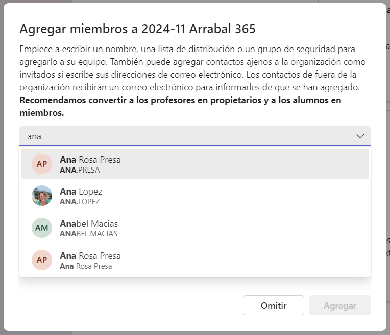
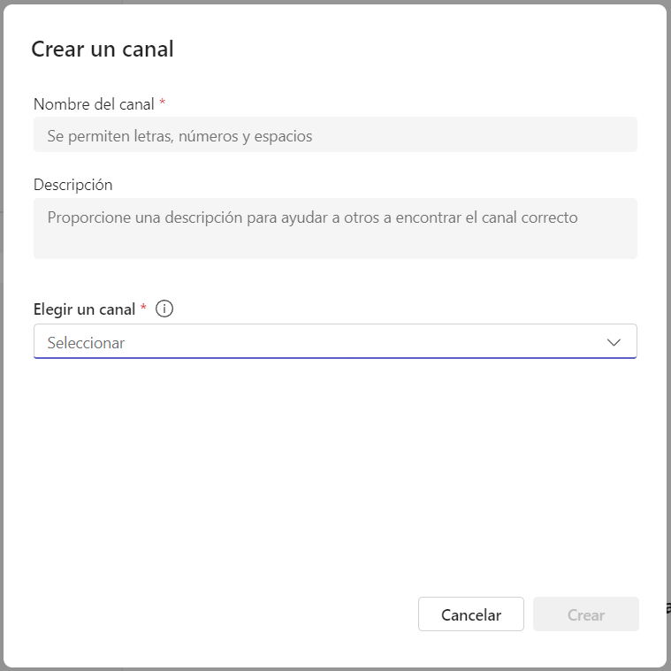
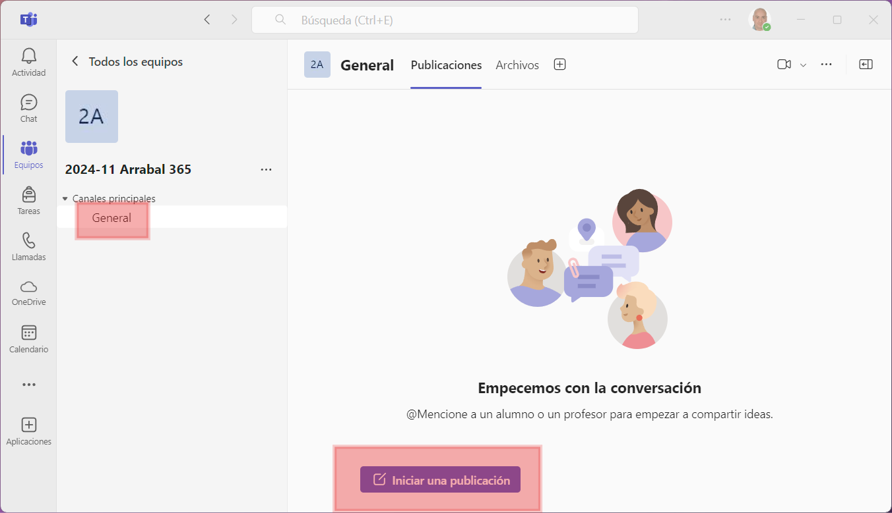
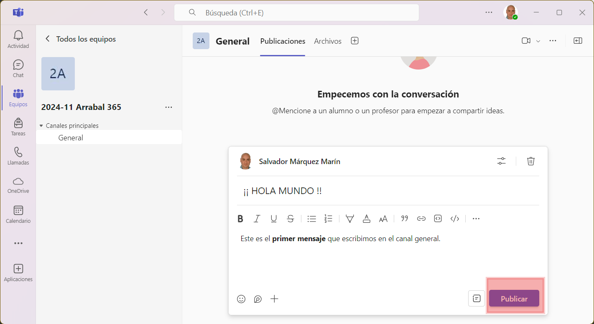
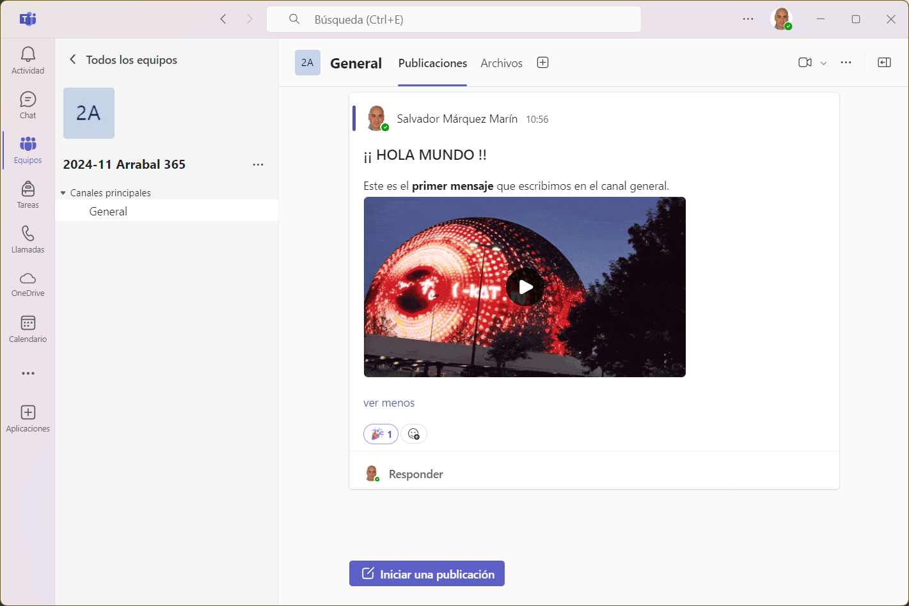
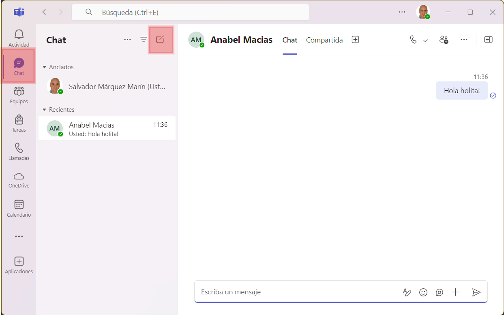
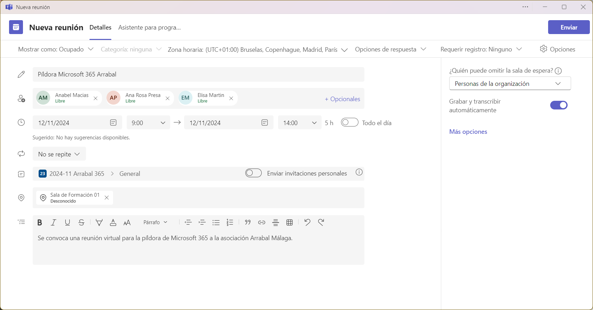

    
Microsoft Teams

    
Comunicación y Colaboración en Equipo

[TOC]

---

# Introducción a Microsoft Teams

Esta herramienta **centraliza la comunicación y la colaboración en un solo lugar**. Equipos de trabajo de cualquier organización pueden coordinarse, organizarse y colaborar a través de conversaciones, reuniones, archivos y tareas, todo desde una misma plataforma. Esto es especialmente útil en una ONG, ya que permite a empleados y voluntarios conectar y colaborar sin importar dónde se encuentren.

# Creación y organización de equipos y canales

**Una vez dentro de Teams**, lo primero es organizar el espacio de trabajo creando equipos y canales. Un "equipo" es un grupo de personas que colaboran en un proyecto o área en particular, mientras que los "canales" permiten subdividir y ordenar el contenido en temas específicos. Esto ayuda a estructurar la información, asegurando que todos los miembros del equipo encuentren lo que necesitan fácilmente.

1. **Crear un equipo:** Para iniciar, en la pantalla principal de Teams, selecciona **Equipos** > **Unirse o crear un equipo** > **Crear un equipo**. Puedes elegir entre varias opciones para crear un equipo según las necesidades del proyecto.

   

2. **Agregar miembros:** Tras crear el equipo, añade a los empleados o voluntarios que participarán en ese proyecto específico.

   

3. **Canales:** Los canales permiten dividir el equipo en temas o áreas, organizando mejor la comunicación. Por ejemplo, podrías crear un canal para "Campañas de Donación" y otro para "Eventos Locales".

   

> [!TIP]
>
> El orden de creación no tiene por qué ser estrictamente `equipo` > `miembros` > `canales`. Se puede crear `equipo` > `canales` > `miembros`. Esto nos asegura tener el equipo totalmente configurado y terminado antes de invitar a los miembros.

👩‍🏫**Ejemplo:** Para la formación de este curso haremos lo siguiente:

1. **Creamos un EQUIPO:** Lo creará el formador y verás algunos detalles de como configurar y crear tu equipo. Lo llamaremos **`2025-07 Microsoft 365`** o algo parecido.
2. **Añadimos los MIEMBROS:** Una vez creado el equipo, el siguiente paso es añadirle los miembros. Se pueden unir de varias formas:
   1. **Añadiendo los miembros manualmente:** Cada miembro recibirá una invitación en su correo electrónico para unirse al equipo.
   2. **Compartiendo un enlace:** Puedes crear un enlace de invitación y enviarlo o publicarlo donde quieras, de forma que cualquier persona que pueda acceder al enlace pueda unirse al equipo.
3. **Crear CANALES:** Una vez creado el equipo y añadidos los miembros, podemos crear canales. Por defecto siempre existe un canal llamado `General`. Podemos añadir tantos canales como queramos. El administrador del equipo (👩‍🏫) creará un canal de `Dudas` y otro de `Off-Topic`. De esta forma cada miembro puede escribir en los canales correspondientes según el tipo de mensaje. El canal de `Dudas` servirá para preguntas específicas relacionadas con la formación o las tareas (ojalá que no haya😅), mientras que el canal de `Off-Topic` permitirá a los miembros compartir mensajes informales o temas no relacionados con el trabajo, ayudando a mantener la comunicación organizada y fácil de seguir.

> [!warning]
>
> Cuando hay un exceso de canales, los miembros del equipo pueden sentirse abrumados y tener dificultades para decidir en cuál de ellos deben publicar sus mensajes. Esto no solo puede causar confusión, sino también reducir la eficiencia de la comunicación y la colaboración dentro del equipo. Por lo tanto, **es recomendable mantener una estructura de canales clara** y bien organizada, **limitando su número a los necesarios** para facilitar la interacción y el intercambio de información.

# Uso de chat, llamadas y videoconferencias

**La comunicación en tiempo real** es clave para la efectividad de Teams. Los chats, las llamadas y las videoconferencias permiten que los equipos se comuniquen ágilmente sin salir de la plataforma, eliminando la necesidad de correos largos y facilitando respuestas rápidas.

- **Chat individual y grupal:** Usa el chat para conversaciones rápidas. Es ideal para consultas inmediatas y se puede utilizar tanto para mensajes uno a uno como para grupos.
- **Menciones y notificaciones:** Usar menciones asegura que la persona reciba una alerta directa. Esto es útil para mensajes importantes.
- **Videoconferencias:** Cuando es necesario discutir temas en profundidad, las videollamadas son útiles. Puedes iniciar una videollamada desde cualquier chat o canal, y Teams ofrece funciones como compartir pantalla y grabación.
- **Llamadas de voz:** Si prefieres una conversación sin video, las llamadas de voz ofrecen una alternativa ágil y práctica.

Puedes pensar que todo esto ya lo hace aplicaciones como Whatsapp (o cualquier otra aplicación de mensajería como Skype o Telegram) y que no es necesario aprender a manejar otra más. Pero hay muchas diferencias.

**Microsoft Teams ofrece varias ventajas significativas** frente a aplicaciones más comunes como WhatsApp en un entorno empresarial. 

- **Teams integra herramientas de productividad** como Office 365, permitiendo a los usuarios colaborar en documentos en tiempo real sin salir de la aplicación. 
- **Teams proporciona una estructura organizada** mediante canales y equipos, lo que facilita la gestión de proyectos y la comunicación segmentada por temas.
- **Teams permite a los usuarios indicar su horario laboral y su ubicación**, ya sea que trabajen en remoto o en la oficina, e incluso especificar en qué oficina están. Esta funcionalidad facilita la coordinación y la planificación de reuniones, asegurando que todos los miembros del equipo estén al tanto de la disponibilidad y ubicación de sus colegas.
- **Teams ofrece ventajas en términos de privacidad**, ya que no requiere el número de teléfono de los usuarios para su funcionamiento. Esto protege la información personal y reduce el riesgo de uso indebido de datos. Además, Teams facilita la gestión de miembros del equipo, permitiendo eliminar rápidamente a aquellos que ya no pertenecen a la empresa, asegurando que solo el personal autorizado tenga acceso a la información y las comunicaciones internas. En contraste, aplicaciones como WhatsApp dependen de números de teléfono y no ofrecen la misma facilidad para gestionar la membresía de grupos en un entorno empresarial.
- **Teams permite a los usuarios silenciar canales fuera del horario laboral**, lo que ayuda a mantener un equilibrio saludable entre el trabajo y la vida personal.

Estas características hacen de Teams una solución más robusta y adecuada para las necesidades de comunicación y colaboración en el ámbito empresarial.

A continuación veremos las formas más habituales de comunicación que hay en Teams.

## ✍️Publicar mensajes en un canal

Para iniciar una conversación en un canal, selecciona el canal deseado, escribe tu mensaje en el cuadro de texto que aparece en la parte inferior y selecciona **Enviar**. 

> [!warning]
>
> Recuerda que los mensajes en un canal son públicos para todos los miembros del equipo, así que cuidadito con lo que se publica.

> [!tip]
>
> En los mensajes tenemos bastantes herramientas para darle un formato a nuestros mensajes y ponerlos bien guapos. Podemos incluir imágenes, tablas, trozos de código, etc.

> [!tip]
>
> Una forma rápida de responder es usando las reacciones. Estos son los emojis que aparecen en la parte inferior de todas las publicaciones. Es más rápido y simple reaccionar con 👍o con 🥒 que respondiendo con texto.

## ↪️Responder a mensajes en un hilo

Cada mensaje publicado en un canal puede ser respondido directamente, generando un "hilo". Esto mantiene las conversaciones organizadas, permitiendo que cada tema quede agrupado. Es recomendable usar los hilos cuando el mensaje original ya tiene respuestas, para no saturar el canal con mensajes fuera de contexto.

> [!caution]
>
> Si vas a responder a alguien, no crees una nueva publicación. Esto desvirtua totalmente la organización y hace que la información esté desordenada. Usa siempre la opción de `Responder` si tu intención es responder a un mensaje previo.

> [!tip]
>
> Si quieres que alguien en particular vea tu mensaje, puedes mencionarlo escribiendo “@” seguido de su nombre. Esta persona recibirá una notificación directa, lo que asegura que no se pierda información importante.

## 👥Hablar en un chat privado

**Los chats privados** permiten que dos o más personas conversen en un espacio privado, sin que el resto del equipo tenga acceso a sus mensajes. Esta opción es ideal para consultas rápidas o para hablar de temas que solo competen a un pequeño grupo de miembros, como una duda puntual o una actualización sobre un tema específico.

1. **Iniciar un chat privado:** Para comenzar un chat privado, selecciona la pestaña **Chat** en la barra lateral izquierda y luego haz clic en **Nuevo chat** (el ícono de lápiz). Ingresa el nombre de la persona o personas con quienes quieres conversar y escribe tu mensaje.

   

2. **Agregar más personas a un chat existente:** Puedes añadir más personas a un chat en cualquier momento. Solo selecciona **Agregar participantes** y selecciona a los nuevos miembros. Teams te da la opción de incluir el historial de mensajes o empezar desde cero, según la relevancia de la conversación pasada para los nuevos integrantes.

> [!tip]
>
> Si estás trabajando en un proyecto y necesitas coordinar detalles específicos con uno o dos compañeros, el chat privado es ideal. Puedes discutir temas rápidos, compartir documentos directamente y recibir respuestas en tiempo real.

## 📞Llamadas de voz y video

**Las llamadas de voz y videollamadas** son ideales para aquellos momentos en que una conversación por texto no es suficiente. Con Teams, puedes hacer una llamada de voz o de video a otros miembros de tu equipo, ya sea de forma individual o en grupo, sin tener que salir de la plataforma.

1. **Realizar una llamada desde un chat:** Para iniciar una llamada, ve a cualquier chat (privado o en un canal) y selecciona el ícono de **Llamada** o **Videollamada** en la parte superior. Esto iniciará una llamada con todos los participantes del chat.
2. **Llamadas de voz vs. videollamadas:** Las llamadas de voz son útiles para cuando quieres conversar sin usar la cámara, mientras que las videollamadas son mejores para reuniones cara a cara o presentaciones. Además, en ambas opciones puedes compartir tu pantalla y colaborar en documentos durante la llamada.

> [!tip]
>
> Si estás tratando de resolver un problema complejo o necesitas una explicación visual, puedes iniciar una videollamada con un compañero y usar la función de compartir pantalla para mostrar y discutir detalles específicos.

> [!note]
>
> Además, recuerda que Teams está disponible como aplicación de escritorio pero también como aplicación móvil, por lo que es mucho más fácil estar conectados independientemente de que dispositivo estés usando.
>
> 

# Colaboración en archivos dentro de Teams

**Un aspecto destacado de Teams** es su capacidad para trabajar en documentos de manera colaborativa. Esto permite a varios miembros editar documentos en tiempo real y mantener los archivos organizados y centralizados en un solo lugar.

1. **Subir y organizar archivos:** La pestaña **Archivos** en cada canal facilita el almacenamiento de documentos importantes. Desde aquí, puedes subir archivos y mantener una organización clara.
2. **Edición en tiempo real:** Los documentos cargados en un canal pueden ser editados por varios miembros al mismo tiempo, lo que permite colaborar de manera directa y evitar duplicados.
3. **Control de versiones:** Teams guarda versiones anteriores de los documentos, lo que permite revertir cambios si es necesario.

> [!tip]
>
> 🧑‍🏫 ¿Podemos empezar por compartir el temario en PDF para que lo tengamos todos verdad? Así comprobamos lo fácil que es compartir documentos de una forma mucho más eficiente que usando el correo electrónico.

# Organización de reuniones y eventos

**La planificación y organización de reuniones** es esencial para el trabajo en equipo en una ONG. Teams ofrece herramientas que simplifican la programación de reuniones, asegurando que todos los participantes puedan asistir y recordando los compromisos de cada miembro.

> [!note]
>
> Fíjate que cuando invites a una persona a la reunión, Teams te proporcionará si en ese horario está libre o no. Puede que esté fuera de su horario laboral, o que ese día no trabaje o esté fuera de la oficina.

1. **Programar reuniones:** Puedes organizar reuniones desde la pestaña **Calendario** en Teams, lo que facilita la programación y permite que los participantes reciban invitaciones automáticas.
2. **Integración con Outlook:** Teams está integrado con Outlook, de modo que cualquier reunión programada en Teams se verá reflejada en el calendario de Outlook.
3. **Uso de funciones avanzadas en reuniones:** Durante las reuniones, puedes utilizar funciones como salas de grupos, encuestas y el levantamiento de manos, ayudando a mejorar la experiencia de cada participante.

> [!tip]
>
> Al programar una reunión, se publicará automáticamente en el canal `General` (o el que elijas) un mensaje con la información de la reunión y un botón para unirse cuando llegue el momento.
>
> 

# Buenas Prácticas para el Uso de Teams en una organización

**Finalmente**, es útil establecer buenas prácticas para sacar el máximo provecho de Teams y mantener la plataforma organizada. Esto asegura que la colaboración sea eficaz y que el entorno de trabajo se mantenga ordenado y accesible.

- **Uso de etiquetas y menciones:** Usar etiquetas específicas facilita notificar solo a los miembros relevantes sin molestar a todo el equipo.
- **Archivos bien organizados:** Mantener los documentos ordenados evita duplicados y hace que la información sea fácil de encontrar.
- **Normas de comunicación:** Definir algunas normas dentro del equipo ayuda a mantener la claridad en la comunicación.
- **Revisión y limpieza periódica de equipos y canales:** Revisar y archivar o eliminar equipos y canales antiguos mantiene el espacio de trabajo eficiente y fácil de navegar.
