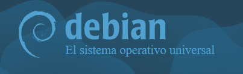
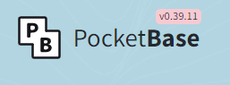

[TOC]

# Widgets

Son pequeños trozos de contenido personalizado con CSS propio, para mostrar la información del temario de distintas formas. Veremos su documentación, código para personalizarlos y código fuente para usarlo directamente en markdown.

# Creación

Un widget será un div html con un atributo concreto que cargará el componente `contenido`. Para crear un widget, solo hay que añadir su reglas css en el archivo `widgets.css` y después usar su identificador como muestra la siguiente documentación.

```html
<div data-widget="stepper">
    ...
</div>
```

```html
<div data-widget="alert">
    
</div>
```

> [!important]
>
> Para definir un widget, crearemos sus reglas de visualización en el archivo `widgets.css` y listo.

# Variantes

## Clases comunes

Los widgets disponen de algunas clases CSS comunes que permiten modificar su apariencia global de forma sencilla. Estas clases pueden combinarse entre sí y se pueden utilizar en los distintos widgets del temario según las necesidades de cada uno.

- `widget-bordered` — Añade un borde con el color del widget, esquinas redondeadas y un espacio interior.
- `widget-centered` — Lo centra horizontalmente, en lugar de a la izquierda como los textos por defecto.

## Colores contextuales

Para indicar el color del widget se pueden utilizar las siguientes clases:

- `widget-primary` — 🎨 Utiliza el color principal del tema de PrimeNG. Es el color utilizado por defecto si no se especifica ninguna variante.
- `widget-info` — 🔵 Utiliza un color contextual para información.
- `widget-success` — 🟢 Utiliza un color contextual para indicar un resultado positivo o de éxito.
- `widget-warning` — 🟡 Utiliza un color contextual para advertencias o precauciones.
- `widget-danger` — 🔴 Utiliza un color contextual para errores o situaciones críticas.
- `widget-light` — ⚪ Utiliza un color claro como variante contextual.
- `widget-dark` — ⚫ Utiliza un color oscuro como variante contextual.

> [!tip]
>
> Un widget puede combinar varias clases para conseguir el aspecto deseado: 
>
> ```html
> <div data-widget="alert" class="widget-success widget-bordered widget-centered">
>     
> </div>
> ```

# Biblioteca de widgets

## Stepper

El widget <kbd>stepper</kbd> permite representar de forma visual y ordenada una serie de pasos que deben seguirse para completar un proceso o procedimiento. Cada paso se muestra numerado y conectado con el siguiente mediante una línea vertical, pudiendo incluir un título, texto descriptivo, imágenes u otros elementos HTML. 

El color y estilo del stepper se puede personalizar mediante las variantes disponibles para los widgets.

> [!note]
>
> Las imágenes que haya en un stepper, se alinearán a la izquierda, sobrescribiendo el centrado original de todas las imágenes.

```html
<div data-widget="stepper">
    <ol>
        <li>
            <div>
                <strong>Instalar Debian</strong>
                <p>Descarga e instala Debian en la máquina virtual.</p>
                
            </div>
        </li>
        <li>
            <div>
                <strong>Configurar SSH</strong>
                <p>Configura el acceso remoto a la máquina.</p>
            </div>
        </li>
        <li>
            <div>
                <strong>Instalar PocketBase</strong>
                <p>Descarga PocketBase y prepara su directorio de trabajo.</p>
                
            </div>
        </li>
    </ol>
</div>
```

**Ejemplo:**

---

<div data-widget="stepper">
    <ol>
        <li>
            <div>
                <strong>Instalar Debian</strong>
                <p>Descarga e instala Debian en la máquina virtual.</p>
                
            </div>
        </li>
        <li>
            <div>
                <strong>Configurar SSH</strong>
                <p>Configura el acceso remoto a la máquina.</p>
            </div>
        </li>
        <li>
            <div>
                <strong>Instalar PocketBase</strong>
                <p>Descarga PocketBase y prepara su directorio de trabajo.</p>
                
            </div>
        </li>
    </ol>
</div>


## Alert

{{ Vamos a hacer simples alerts como los de bootstrap, pero en un div. SIMPLES. Un color, un título y un texto, reusando las mismas clases comunes }}

## Details

{{ Un bloque expandible con contenido adicional en su interior }}

## Tabs

{{ Contenidos separados por pestañas }}